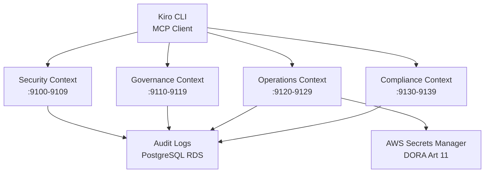

<link rel="stylesheet" href="../../platform-resources/styles/virons-markdown.css">
<button onclick="const t=document.body.classList.toggle('theme-light');localStorage.setItem('theme',t?'light':'dark')" style="position:fixed;top:1rem;right:1rem;padding:0.5rem 1rem;border-radius:6px;border:1px solid var(--color-border);background:var(--color-code-bg);color:var(--color-text);cursor:pointer;z-index:1000;">Toggle Theme</button>
<script>if(localStorage.getItem('theme')==='light')document.body.classList.add('theme-light')</script>

# Virons MCP Documentation

## Overview

***

Model Context Protocol (MCP) servers for security, governance, and compliance automation. **BaFin/DORA/GDPR compliant** with audit logging and policy enforcement.

**Production-ready MCP infrastructure for AI-assisted development.** Deployed on Kind (local) and EKS (eu-central-1)—encrypted secrets, automated rotation.

| Category | Description |
|----------|-------------|
| **Audience** | Platform engineers, security teams, compliance officers |
| **Purpose** | Automated security scanning, policy enforcement, secret rotation |
| **Domain** | `mcp.virons.ai` |
| **Context** | Development tooling, CI/CD security gates |
| **Status** | **Production** |
| **Provider** | Virons AI GmbH (DE) |

## Architecture

***

**MCP Server Infrastructure**: Python FastAPI → Kind/EKS → PostgreSQL audit logs. Event-driven compliance validation.

**Diagram**: 

***



## Contents

***

```
platform-mcp/
├── src/virons_mcp/           # MCP server implementations
│   ├── security/              # gitleaks, compliance-gate
│   ├── governance/            # org-governance, workflow-governance
│   ├── operations/            # secrets-rotation
│   └── compliance/            # compliance-checklist
├── docs/
│   ├── architecture/          # DDD, ADRs, diagrams
│   ├── compliance/            # BaFin, GDPR, DORA evidence
│   ├── operations/            # Runbooks, procedures
│   └── getting-started/       # Quickstart guides
├── charts/virons-mcp/         # Helm charts
├── infrastructure/            # Kind, EKS configs
└── tests/                     # Integration tests
```

## Key Features

***

- **Security Scanning**: Pre-commit gitleaks integration (BaFin AT 8.1 audit trail)
- **Policy Enforcement**: Org-level governance with automated validation
- **Secret Rotation**: DORA Art 11 compliant automated rotation (<90d)
- **Compliance Gates**: Multi-regulation validation (BaFin/GDPR/DORA)
- **Audit Logging**: Immutable PostgreSQL logs (7yr retention)

## MCP Servers

***

### Security Context (9100-9109)

| Server | Port | Purpose | Compliance |
|--------|------|---------|------------|
| **gitleaks** | 9100 | Pre-commit secret scanning | BaFin AT 8.1 |
| **compliance-gate** | 9101 | Pre-commit compliance checks | GDPR Art 25 |

### Governance Context (9110-9119)

| Server | Port | Purpose | Compliance |
|--------|------|---------|------------|
| **org-governance** | 9102 | Organization policy enforcement | BaFin AT 8.1 |
| **workflow-governance** | 9103 | Workflow validation | DORA Art 11 |

### Operations Context (9120-9129)

| Server | Port | Purpose | Compliance |
|--------|------|---------|------------|
| **secrets-rotation** | 9104 | Automated secret rotation | DORA Art 11 |

### Compliance Context (9130-9139)

| Server | Port | Purpose | Compliance |
|--------|------|---------|------------|
| **compliance-checklist** | 9105 | Multi-regulation validation | BaFin/GDPR/DORA |

## Usage

***

```bash
# Deploy to Kind (local)
kind create cluster --config infrastructure/kind-config.yaml
helm install virons-mcp charts/virons-mcp

# Deploy to EKS (production)
kubectl config use-context virons-prod-eu-central-1
helm upgrade --install virons-mcp charts/virons-mcp -f values-prod.yaml

# Test MCP server
curl http://localhost:9100/health
```

## Dependencies

***

| Dep | Purpose | Compliance |
|-----|---------|------------|
| FastAPI | MCP server framework | - |
| PostgreSQL | Audit logs | 7yr retention (BaFin) |
| AWS Secrets Manager | Secret storage | DORA Art 11 |
| Kind/EKS | Container orchestration | DORA resilience |

## Testing

***

```bash
# Unit tests
pytest tests/servers/ -v

# Integration tests
pytest tests/integration/ --kind-cluster

# Compliance validation
python scripts/validate_compliance.py
```

## Metrics & Monitoring

***

- **CloudWatch**: `/aws/virons/mcp` (90d retention)
- **Audit Logs**: `/aws/virons/audit/mcp` — **7-year immutable** (BaFin AT 8.1)
- **Alarms**: PagerDuty → Platform team
- **Health Checks**: `/health` endpoint on all servers

## Security & Compliance

***

| Regulation | Requirement | Implementation | Evidence |
|------------|-------------|----------------|----------|
| **BaFin MaRisk AT 8.1** | Audit trail | PostgreSQL audit logs | [audit-schema.sql](compliance/evidence/) |
| **GDPR Art 25** | Data protection by design | Compliance-gate validation | [gdpr-compliance.md](compliance/gdpr/) |
| **GDPR Art 32** | Security of processing | TLS 1.3, encrypted secrets | [security-controls.md](security/) |
| **DORA Art 11** | ICT risk management | Secret rotation <90d | [dora-compliance.md](compliance/dora/) |

## Quick Links

***

### For Developers
- [Quickstart Guide](getting-started/QUICKSTART.md)
- [Scaffold Virons Server](../scripts/scaffold_virons_server.py)
- [Contributing Guide](development/contributing/README.md)

### For Operators
- [Runbooks](operations/runbooks/)
- [Procedures](operations/procedures/)

### For Architects
- [DDD Context Map](architecture/ddd/CONTEXT-MAP.md)
- [ADRs](architecture/decisions/)
- [Architecture Diagrams](architecture/diagrams/)
- **[AWS MCP Server Audit](architecture/aws-mcp-audit/)** ⭐ NEW
  - [Server Catalog](architecture/aws-mcp-audit/SERVER-CATALOG.md) - 67 AWS MCP servers
  - [Scoring Framework](architecture/aws-mcp-audit/SCORING-FRAMEWORK.md) - Integration prioritization
  - [Server Scores](architecture/aws-mcp-audit/SERVER-SCORES.md) - Tier 1/2/3 assignments
  - [Context Mapping](architecture/aws-mcp-audit/CONTEXT-MAPPING.md) - Port allocation
  - [Integration Backlog](architecture/aws-mcp-audit/INTEGRATION-BACKLOG.md) - Phase 2/3 roadmap
  - [Implementation Checklist](architecture/aws-mcp-audit/IMPLEMENTATION-CHECKLIST.md) - Execution plan

### For Compliance
- [BaFin Compliance](compliance/bafin/)
- [GDPR Compliance](compliance/gdpr/)
- [DORA Compliance](compliance/dora/)

## Navigation
← [platform-infrastructure README](../../platform-infrastructure/README.md)

***

**Last Updated**: 2026-03-05  
**Maintained By**: platform@virons.ai  
**On-Call**: [PagerDuty](https://virons-platform.pagerduty.com)  
**Status**: ✅ Production
