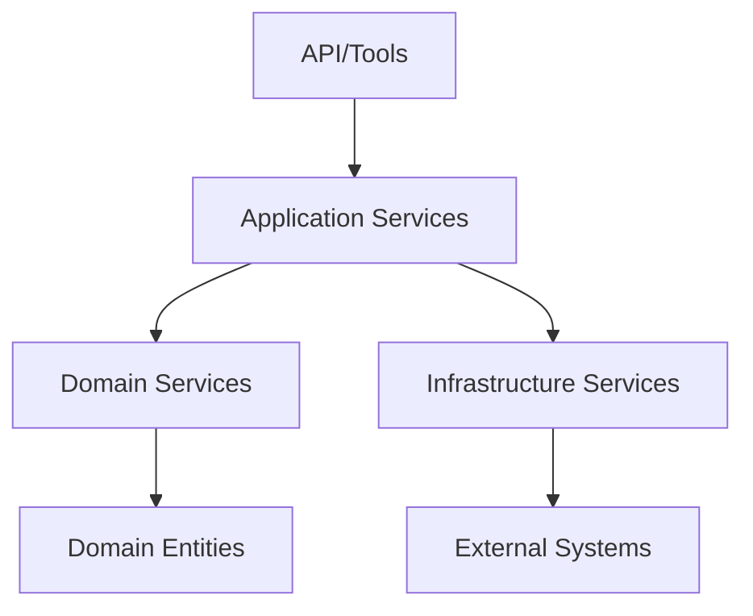

<link rel="stylesheet" href="../../platform-resources/styles/virons-markdown.css">
<button onclick="const t=document.body.classList.toggle('theme-light');localStorage.setItem('theme',t?'light':'dark')" style="position:fixed;top:1rem;right:1rem;padding:0.5rem 1rem;border-radius:6px;border:1px solid var(--color-border);background:var(--color-code-bg);color:var(--color-text);cursor:pointer;z-index:1000;">Toggle Theme</button>
<script>if(localStorage.getItem('theme')==='light')document.body.classList.add('theme-light')</script>

# Application Layer

## Overview

***

Orchestrates domain concepts to implement business workflows and use cases. Coordinates between domain layer and infrastructure layer following DDD principles.

| Category | Description |
|----------|-------------|
| **Audience** | Developers, architects, workflow designers |
| **Purpose** | Document business workflows and use case orchestration |
| **Domain** | `virons.ai/platform-mcp/application` |
| **Context** | Application service layer in DDD architecture |
| **Status** | **Active** |

## Architecture

***

**Application Services Pattern**: Thin orchestration layer over domain logic, coordinating multiple domain services and managing workflow state.

**Diagram**:

***



## Contents

***

```
application/
├── workflows/              # Business workflows
│   ├── WORKFLOW-COMPLIANCE-COMPARISON.md
│   ├── WORKFLOW-IMPLEMENTATION-SUMMARY.md
│   └── 3-REPO-WORKFLOW-COMPARISON.md
└── README.md              # This file
```

## Key Features

***

- **Use Case Orchestration**: Coordinate multiple domain services
- **Transaction Management**: Handle workflow boundaries and state
- **Integration Coordination**: Manage upstream service calls
- **Validation & Authorization**: Enforce business rules and policies

## Workflows

***

### [Compliance Workflows](workflows/WORKFLOW-COMPLIANCE-COMPARISON.md)
Analysis of compliance workflow patterns across the platform.

### [Workflow Implementation](workflows/WORKFLOW-IMPLEMENTATION-SUMMARY.md)
Summary of implemented workflows and their patterns.

### [Repository Workflows](workflows/3-REPO-WORKFLOW-COMPARISON.md)
Comparison of workflow patterns across repositories.

## DDD Principles

***

| Principle | Implementation |
|-----------|----------------|
| **Application Services** | Thin orchestration over domain logic |
| **Use Cases** | Each workflow represents specific use case |
| **Transaction Scripts** | Simple workflows for straightforward operations |
| **Command Handlers** | Process commands and coordinate domain operations |

## Workflow Patterns

***

### Synchronous Workflows
- Direct tool invocation
- Immediate response required
- Simple orchestration

### Asynchronous Workflows
- Long-running operations
- Event-driven coordination
- Saga patterns for distributed transactions

### Compliance Workflows
- Audit logging at each step
- Evidence collection
- Approval gates
- Rollback capabilities

## Relationship to Other Layers

***

- **Domain Layer**: Uses domain services and entities to implement workflows
- **Infrastructure Layer**: Delegates technical concerns (persistence, messaging)
- **Presentation Layer**: Exposes workflows through APIs and tools

## Navigation

← [Documentation Index](../INDEX.md) | [Domain Layer](../domain/README.md) →

***

**Last Updated**: 2026-03-07

**Maintained By**: platform-team@virons.ai
