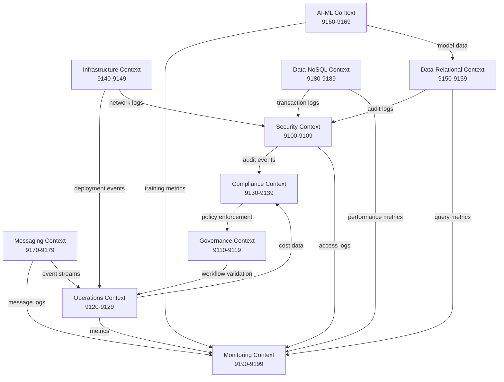

<link rel="stylesheet" href="../../../../platform-resources/styles/virons-markdown.css">

# AWS MCP Server Context Mapping

**Status**: ✅ Complete  
**Date**: 2026-03-05  
**Purpose**: Map Tier 1 AWS MCP servers to virons-mcp-server bounded contexts

***

## Overview

This document maps 34 Tier 1 AWS MCP servers to bounded contexts based on primary responsibility. Due to port capacity constraints (10 ports per context), we expand from 4 original contexts to 10 contexts to accommodate all Tier 1 servers.

***

## Context Expansion Strategy

### Original Contexts (9100-9139)
- **Security**: 9100-9109 (10 ports)
- **Governance**: 9110-9119 (10 ports)
- **Operations**: 9120-9129 (10 ports)
- **Compliance**: 9130-9139 (10 ports)

### New Contexts (9140-9189)
- **Infrastructure**: 9140-9149 (10 ports)
- **Data-Relational**: 9150-9159 (10 ports)
- **AI-ML**: 9160-9169 (10 ports)
- **Messaging**: 9170-9179 (10 ports)
- **Data-NoSQL**: 9180-9189 (10 ports)
- **Monitoring**: 9190-9199 (10 ports)

***

## Context Mapping Table

### Security Context (9100-9109)

| Port | Server | Primary Responsibility | Secondary Contexts |
|------|--------|------------------------|-------------------|
| 9100 | gitleaks | Secret scanning | Compliance |
| 9101 | compliance-gate | Compliance validation | Compliance |
| 9102 | **cloudtrail-mcp-server** | Audit trail, security investigations | Compliance, Operations |
| 9103 | **iam-mcp-server** | Access control, IAM management | Governance, Compliance |
| 9104 | **well-architected-security-mcp-server** | Security posture assessment | Compliance |
| 9105-9109 | *Reserved* | Future security servers | - |

**Capacity**: 5/10 used, 5 reserved

***

### Governance Context (9110-9119)

| Port | Server | Primary Responsibility | Secondary Contexts |
|------|--------|------------------------|-------------------|
| 9110 | org-governance | Org-level policy checks | Compliance |
| 9111 | workflow-governance | Workflow validation | Compliance |
| 9112-9119 | *Reserved* | Future governance servers | - |

**Capacity**: 2/10 used, 8 reserved  
**Note**: No Tier 1 AWS MCP servers map primarily to Governance

***

### Operations Context (9120-9129)

| Port | Server | Primary Responsibility | Secondary Contexts |
|------|--------|------------------------|-------------------|
| 9120 | secrets-rotation | Automated secret rotation | Security, Compliance |
| 9121 | **eks-mcp-server** | Kubernetes cluster management | Infrastructure |
| 9122 | **lambda-tool-mcp-server** | Serverless function management | Infrastructure |
| 9123 | **ecs-mcp-server** | Container orchestration | Infrastructure |
| 9124 | **stepfunctions-tool-mcp-server** | Workflow orchestration | Infrastructure |
| 9125-9129 | *Reserved* | Future operations servers | - |

**Capacity**: 5/10 used, 5 reserved

***

### Compliance Context (9130-9139)

| Port | Server | Primary Responsibility | Secondary Contexts |
|------|--------|------------------------|-------------------|
| 9130 | compliance-checklist | Multi-regulation validation | Security, Governance |
| 9131 | **cost-explorer-mcp-server** | Cost transparency (BaFin AT 8.1) | Operations |
| 9132 | **billing-cost-management-mcp-server** | Financial controls (BaFin) | Operations |
| 9133-9139 | *Reserved* | Future compliance servers | - |

**Capacity**: 3/10 used, 7 reserved

***

### Infrastructure Context (9140-9149) **NEW**

| Port | Server | Primary Responsibility | Secondary Contexts |
|------|--------|------------------------|-------------------|
| 9140 | **cdk-mcp-server** | AWS CDK infrastructure as code | Operations |
| 9141 | **cfn-mcp-server** | CloudFormation stack management | Operations |
| 9142 | **terraform-mcp-server** | Terraform IaC operations | Operations |
| 9143 | **aws-iac-mcp-server** | General IaC operations | Operations |
| 9144 | **aws-network-mcp-server** | VPC and network management | Security, Operations |
| 9145-9149 | *Reserved* | Future infrastructure servers | - |

**Capacity**: 5/10 used, 5 reserved

***

### Data-Relational Context (9150-9159) **NEW**

| Port | Server | Primary Responsibility | Secondary Contexts |
|------|--------|------------------------|-------------------|
| 9150 | **postgres-mcp-server** | PostgreSQL operations, audit logs | Compliance, Security |
| 9151 | **mysql-mcp-server** | MySQL operations | Compliance |
| 9152 | **aurora-dsql-mcp-server** | Aurora distributed SQL | Operations |
| 9153 | **redshift-mcp-server** | Data warehouse, analytics | AI-ML |
| 9154-9159 | *Reserved* | Future relational DB servers | - |

**Capacity**: 4/10 used, 6 reserved

***

### AI-ML Context (9160-9169) **NEW**

| Port | Server | Primary Responsibility | Secondary Contexts |
|------|--------|------------------------|-------------------|
| 9160 | **sagemaker-ai-mcp-server** | ML training/inference | Operations |
| 9161 | **bedrock-kb-retrieval-mcp-server** | RAG, semantic search | Data-NoSQL |
| 9162 | **amazon-kendra-index-mcp-server** | Intelligent search | Data-NoSQL |
| 9163-9169 | *Reserved* | Future AI/ML servers | - |

**Capacity**: 3/10 used, 7 reserved

***

### Messaging Context (9170-9179) **NEW**

| Port | Server | Primary Responsibility | Secondary Contexts |
|------|--------|------------------------|-------------------|
| 9170 | **amazon-sns-sqs-mcp-server** | Pub/sub messaging, queues | Operations |
| 9171 | **aws-msk-mcp-server** | Kafka streaming | Operations, Data-NoSQL |
| 9172-9179 | *Reserved* | Future messaging servers | - |

**Capacity**: 2/10 used, 8 reserved

***

### Data-NoSQL Context (9180-9189) **NEW**

| Port | Server | Primary Responsibility | Secondary Contexts |
|------|--------|------------------------|-------------------|
| 9180 | **dynamodb-mcp-server** | NoSQL key-value, transactions | Operations |
| 9181 | **documentdb-mcp-server** | MongoDB-compatible document DB | Operations |
| 9182 | **amazon-keyspaces-mcp-server** | Cassandra-compatible wide-column | Operations |
| 9183 | **amazon-neptune-mcp-server** | Graph database, fraud detection | Security, AI-ML |
| 9184 | **elasticache-mcp-server** | Redis caching, session management | Operations |
| 9185 | **s3-tables-mcp-server** | Iceberg tables, data lake | Data-Relational |
| 9186-9189 | *Reserved* | Future NoSQL servers | - |

**Capacity**: 6/10 used, 4 reserved

***

### Monitoring Context (9190-9199) **NEW**

| Port | Server | Primary Responsibility | Secondary Contexts |
|------|--------|------------------------|-------------------|
| 9190 | **cloudwatch-mcp-server** | Metrics, logs, alarms | Operations, Compliance |
| 9191 | **prometheus-mcp-server** | Time-series metrics | Operations |
| 9192 | **cloudwatch-appsignals-mcp-server** | Service-level monitoring | Operations |
| 9193 | **cloudwatch-applicationsignals-mcp-server** | Application performance | Operations |
| 9194-9199 | *Reserved* | Future monitoring servers | - |

**Capacity**: 4/10 used, 6 reserved

***

## Context Relationships

***

## Multi-Context Servers

Some servers span multiple contexts. Primary context assignment is based on dominant responsibility:

| Server | Primary Context | Secondary Contexts | Rationale |
|--------|----------------|-------------------|-----------|
| **cloudtrail-mcp-server** | Security | Compliance, Operations | Audit trail is security-first, but supports compliance and ops |
| **iam-mcp-server** | Security | Governance, Compliance | Access control is security-first, but enforces governance policies |
| **aws-network-mcp-server** | Infrastructure | Security, Operations | Network infrastructure, but critical for security |
| **postgres-mcp-server** | Data-Relational | Compliance, Security | Relational DB, but stores audit logs |
| **amazon-neptune-mcp-server** | Data-NoSQL | Security, AI-ML | Graph DB, but used for fraud detection |
| **cloudwatch-mcp-server** | Monitoring | Operations, Compliance | Monitoring-first, but critical for ops and compliance |

***

## Port Allocation Summary

| Context | Port Range | Allocated | Reserved | Total |
|---------|------------|-----------|----------|-------|
| Security | 9100-9109 | 5 | 5 | 10 |
| Governance | 9110-9119 | 2 | 8 | 10 |
| Operations | 9120-9129 | 5 | 5 | 10 |
| Compliance | 9130-9139 | 3 | 7 | 10 |
| Infrastructure | 9140-9149 | 5 | 5 | 10 |
| Data-Relational | 9150-9159 | 4 | 6 | 10 |
| AI-ML | 9160-9169 | 3 | 7 | 10 |
| Messaging | 9170-9179 | 2 | 8 | 10 |
| Data-NoSQL | 9180-9189 | 6 | 4 | 10 |
| Monitoring | 9190-9199 | 4 | 6 | 10 |
| **TOTAL** | **9100-9199** | **39** | **61** | **100** |

**Note**: 39 ports allocated (6 existing + 33 new Tier 1 AWS MCP servers)

***

## Integration Priority

### Phase 1 (Immediate - Q2 2026)
- Security Context: CloudTrail, IAM, Well-Architected Security
- Monitoring Context: CloudWatch, Prometheus, Application Signals
- Operations Context: EKS, Lambda, ECS, Step Functions
- Compliance Context: Cost Explorer, Billing

### Phase 2 (Q3 2026)
- Infrastructure Context: CDK, CloudFormation, Terraform, Network
- Data-Relational Context: Postgres, MySQL, Aurora, Redshift
- Data-NoSQL Context: DynamoDB, DocumentDB, Keyspaces, Neptune, ElastiCache, S3 Tables

### Phase 3 (Q4 2026)
- AI-ML Context: SageMaker, Bedrock KB, Kendra
- Messaging Context: SNS/SQS, MSK

***

## Compliance Mapping

### BaFin AT 8.1 (Audit Trail, Access Control)
- **Security**: CloudTrail (audit), IAM (access control)
- **Compliance**: Cost Explorer (cost transparency), Billing (financial controls)
- **Data-Relational**: Postgres (audit log storage)
- **Monitoring**: CloudWatch (operational monitoring)

### GDPR Art 25 (Data Protection by Design)
- **Security**: IAM (access control)
- **Infrastructure**: CDK, CloudFormation, Terraform (infrastructure by design)
- **Data-Relational**: Postgres, MySQL (encrypted storage)

### GDPR Art 32 (Security of Processing)
- **Security**: CloudTrail (security monitoring), IAM (access control)
- **Infrastructure**: Network (network security)
- **Data-Relational**: All DB servers (encryption at rest/transit)
- **Data-NoSQL**: All NoSQL servers (encryption)

### DORA Art 11 (ICT Risk Management)
- **Security**: Well-Architected Security (risk assessment)
- **Monitoring**: CloudWatch, Prometheus (operational resilience)
- **Operations**: EKS, Lambda, ECS (infrastructure resilience)
- **Infrastructure**: Network (network resilience)

***

## Metadata

- **Document Owner**: Platform Architecture Team
- **Last Updated**: 2026-03-05
- **Next Review**: 2026-04-05
- **Related**: [Server Scores](SERVER-SCORES.md), [ADR-001](../decisions/ADR-001-port-allocation.md), [ADR-002](../decisions/ADR-002-aws-mcp-integration.md)
