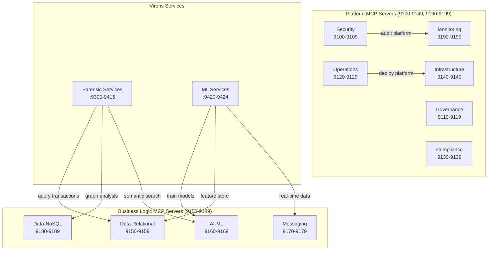

<link rel="stylesheet" href="../../../../platform-resources/styles/virons-markdown.css">

# AWS MCP Server Classification: Platform vs Business Logic

**Status**: ✅ Approved
**Date**: 2026-03-05
**Purpose**: Separate platform infrastructure servers from business logic servers

***

## Overview

AWS MCP servers are classified into two distinct groups:

1. **Platform Servers**: Support development, operations, compliance, security, infrastructure, audit
2. **Business Logic Servers**: Support Virons AI product features and customer-facing capabilities

This separation ensures clear ownership, different deployment strategies, and appropriate cost allocation.

***

## Classification Criteria

### Platform Servers
- **Purpose**: Enable platform engineering, compliance, security, operations
- **Users**: Internal teams (platform engineers, security, compliance, operations)
- **Deployment**: Platform infrastructure namespace
- **Cost Center**: Platform operations budget
- **Availability**: Internal only, not customer-facing
- **Examples**: IAM, CloudTrail, CloudWatch, Cost Explorer, EKS, Terraform

### Business Logic Servers
- **Purpose**: Enable Virons AI product features and customer capabilities
- **Users**: Virons AI services (forensic :9300-9415, ML :9420-9424), customer applications
- **Deployment**: Business logic namespace (virons-services)
- **Cost Center**: Product development budget
- **Availability**: May be customer-facing or service-to-service
- **Examples**: SageMaker, Bedrock, Kendra, DynamoDB, Postgres, Redshift, Neptune

***

## Group 1: Platform MCP Servers (Port Range: 9100-9149)

### Security Context (9100-9109)
| Port | Server | Purpose | Users |
|------|--------|---------|-------|
| 9100 | gitleaks | Pre-commit secret scanning | Developers |
| 9101 | compliance-gate | Pre-commit compliance checks | Developers |
| 9102 | **cloudtrail-mcp-server** | Platform audit trail, security investigations | Security team, compliance |
| 9103 | **iam-mcp-server** | Platform IAM management, access control | Platform engineers, security |
| 9104 | **well-architected-security-mcp-server** | Platform security posture assessment | Security team |

**Rationale**: These servers audit and secure the platform itself, not customer data or business logic.

### Governance Context (9110-9119)
| Port | Server | Purpose | Users |
|------|--------|---------|-------|
| 9110 | org-governance | Organization policy enforcement | Platform engineers |
| 9111 | workflow-governance | Workflow validation | Platform engineers |

**Rationale**: Enforce platform development policies and workflows.

### Operations Context (9120-9129)
| Port | Server | Purpose | Users |
|------|--------|---------|-------|
| 9120 | secrets-rotation | Platform secret rotation | Operations team |
| 9121 | **eks-mcp-server** | Platform Kubernetes cluster management | Platform engineers |
| 9122 | **lambda-tool-mcp-server** | Platform Lambda management | Platform engineers |
| 9123 | **ecs-mcp-server** | Platform container orchestration | Platform engineers |
| 9124 | **stepfunctions-tool-mcp-server** | Platform workflow orchestration | Platform engineers |

**Rationale**: Manage platform infrastructure, not business workloads.

### Compliance Context (9130-9139)
| Port | Server | Purpose | Users |
|------|--------|---------|-------|
| 9130 | compliance-checklist | Platform compliance validation | Compliance team |
| 9131 | **cost-explorer-mcp-server** | Platform cost analysis | FinOps team |
| 9132 | **billing-cost-management-mcp-server** | Platform budget management | FinOps team |

**Rationale**: Monitor platform costs and compliance, not customer usage.

### Infrastructure Context (9140-9149)
| Port | Server | Purpose | Users |
|------|--------|---------|-------|
| 9140 | **cdk-mcp-server** | Platform IaC deployment | Platform engineers |
| 9141 | **cfn-mcp-server** | Platform CloudFormation management | Platform engineers |
| 9142 | **terraform-mcp-server** | Platform Terraform operations | Platform engineers |
| 9143 | **aws-iac-mcp-server** | Platform IaC operations | Platform engineers |
| 9144 | **aws-network-mcp-server** | Platform VPC/network management | Platform engineers |

**Rationale**: Deploy and manage platform infrastructure.

### Monitoring Context (9190-9199)
| Port | Server | Purpose | Users |
|------|--------|---------|-------|
| 9190 | **cloudwatch-mcp-server** | Platform monitoring (metrics, logs, alarms) | Operations team |
| 9191 | **prometheus-mcp-server** | Platform metrics | Operations team |
| 9192 | **cloudwatch-appsignals-mcp-server** | Platform service monitoring | Operations team |
| 9193 | **cloudwatch-applicationsignals-mcp-server** | Platform application monitoring | Operations team |

**Rationale**: Monitor platform health, not business logic services.

**Total Platform Servers**: 24

***

## Group 2: Business Logic MCP Servers (Port Range: 9150-9189)

### Data-Relational Context (9150-9159)
| Port | Server | Purpose | Business Use Case |
|------|--------|---------|-------------------|
| 9150 | **postgres-mcp-server** | Transaction data, audit logs for forensic analysis | Forensic services (:9300-9415) store transaction audit logs |
| 9151 | **mysql-mcp-server** | Application data storage | Legacy application data migration |
| 9152 | **aurora-dsql-mcp-server** | Distributed SQL for high-throughput transactions | Real-time transaction processing |
| 9153 | **redshift-mcp-server** | Data warehouse for forensic analytics | ML feature store (:9420-9424), forensic data analytics |

**Rationale**: Store and analyze business transaction data, not platform logs.

### AI-ML Context (9160-9169)
| Port | Server | Purpose | Business Use Case |
|------|--------|---------|-------------------|
| 9160 | **sagemaker-ai-mcp-server** | ML model training/inference | ML services (:9420-9424) - anomaly detection, fraud detection |
| 9161 | **bedrock-kb-retrieval-mcp-server** | RAG for intelligent search | Forensic analysis - semantic search over transaction data |
| 9162 | **amazon-kendra-index-mcp-server** | Intelligent document search | Compliance document search, knowledge retrieval |

**Rationale**: Power Virons AI product features (forensic analysis, ML models).

### Messaging Context (9170-9179)
| Port | Server | Purpose | Business Use Case |
|------|--------|---------|-------------------|
| 9170 | **amazon-sns-sqs-mcp-server** | Event-driven architecture for business events | Transaction event streaming, forensic event notifications |
| 9171 | **aws-msk-mcp-server** | Kafka streaming for real-time data | Real-time transaction ingestion, event sourcing |

**Rationale**: Handle business events and real-time data streams.

### Data-NoSQL Context (9180-9189)
| Port | Server | Purpose | Business Use Case |
|------|--------|---------|-------------------|
| 9180 | **dynamodb-mcp-server** | High-performance transaction storage | Forensic services (:9300-9415) - transaction ledger, blockchain data |
| 9181 | **documentdb-mcp-server** | Document storage for unstructured data | Transaction metadata, forensic evidence documents |
| 9182 | **amazon-keyspaces-mcp-server** | Wide-column store for time-series | Transaction time-series data, audit trails |
| 9183 | **amazon-neptune-mcp-server** | Graph database for fraud detection | Forensic analysis - transaction graph, relationship analysis |
| 9184 | **elasticache-mcp-server** | Session management, caching | User session state, API response caching |
| 9185 | **s3-tables-mcp-server** | Data lake for analytics | Forensic data lake, ML training data |

**Rationale**: Store business data (transactions, forensic evidence, ML features).

**Total Business Logic Servers**: 16

***

## Port Allocation Summary

| Group | Port Range | Contexts | Servers | Purpose |
|-------|------------|----------|---------|---------|
| **Platform** | 9100-9149, 9190-9199 | 6 contexts | 24 servers | Development, operations, compliance, security, infrastructure, monitoring |
| **Business Logic** | 9150-9189 | 4 contexts | 16 servers | Virons AI product features (forensic, ML, data) |
| **Total** | 9100-9199 | 10 contexts | 40 servers | Complete Tier 1 integration |

***

## Deployment Strategy

### Platform Servers
- **Namespace**: `platform-mcp`
- **Helm Chart**: `charts/platform-mcp`
- **Access**: Internal only (VPC-private)
- **Monitoring**: Platform CloudWatch namespace
- **Cost Allocation**: Platform operations budget
- **Ownership**: Platform engineering team

### Business Logic Servers
- **Namespace**: `virons-services-mcp`
- **Helm Chart**: `charts/virons-services-mcp`
- **Access**: Service-to-service (virons-services can access)
- **Monitoring**: Business logic CloudWatch namespace
- **Cost Allocation**: Product development budget
- **Ownership**: Product engineering team

***

## Access Control

### Platform Servers (9100-9149, 9190-9199)
```yaml
# Network Policy: Only platform engineers and CI/CD
apiVersion: networking.k8s.io/v1
kind: NetworkPolicy
metadata:
  name: platform-mcp-access
  namespace: platform-mcp
spec:
  podSelector:
    matchLabels:
      group: platform
  ingress:
  - from:
    - namespaceSelector:
        matchLabels:
          name: platform-engineering
    - namespaceSelector:
        matchLabels:
          name: ci-cd
```

### Business Logic Servers (9150-9189)
```yaml
# Network Policy: virons-services can access
apiVersion: networking.k8s.io/v1
kind: NetworkPolicy
metadata:
  name: business-logic-mcp-access
  namespace: virons-services-mcp
spec:
  podSelector:
    matchLabels:
      group: business-logic
  ingress:
  - from:
    - namespaceSelector:
        matchLabels:
          name: virons-services
    ports:
    - protocol: TCP
      port: 9150-9189
```

***

## Cost Allocation

### Platform Servers
- **Budget**: Platform operations (OpEx)
- **Chargeback**: Not customer-facing, no chargeback
- **Optimization**: Focus on cost efficiency (reserved instances, spot)

### Business Logic Servers
- **Budget**: Product development (R&D)
- **Chargeback**: May be allocated to customer usage (forensic analysis, ML inference)
- **Optimization**: Focus on performance and scalability

***

## Compliance Implications

### Platform Servers
- **BaFin AT 8.1**: Audit platform changes, access control
- **GDPR Art 25**: Platform security by design
- **DORA Art 11**: Platform resilience and monitoring

### Business Logic Servers
- **BaFin AT 8.1**: Audit customer transactions (Postgres, DynamoDB)
- **GDPR Art 32**: Encrypt customer data (all DB servers)
- **DORA Art 11**: Business continuity (data replication, backups)

***

## Reclassification from Original Audit

### Moved to Platform Group
- CloudTrail (9102) - Platform audit, not business audit
- IAM (9103) - Platform access control
- CloudWatch (9190) - Platform monitoring
- EKS/Lambda/ECS (9121-9123) - Platform infrastructure
- CDK/CloudFormation/Terraform (9140-9142) - Platform IaC
- Cost Explorer/Billing (9131-9132) - Platform cost management

### Moved to Business Logic Group
- Postgres (9150) - Business transaction data
- DynamoDB (9180) - Business transaction ledger
- SageMaker (9160) - Business ML models
- Bedrock KB (9161) - Business semantic search
- Neptune (9183) - Business fraud detection
- Redshift (9153) - Business analytics

### Borderline Cases (Dual-Purpose)
- **Postgres (9150)**: Stores both platform audit logs AND business transaction data
  - **Decision**: Business Logic (primary use case is forensic transaction data)
  - **Alternative**: Deploy two instances (platform-postgres for audit, business-postgres for transactions)

- **CloudWatch (9190)**: Monitors both platform AND business services
  - **Decision**: Platform (primary use case is platform monitoring)
  - **Note**: Business services send metrics to same CloudWatch, but server is platform-owned

***

## Updated Context Map



***

## Metadata

- **Document Owner**: Platform Architecture Team
- **Last Updated**: 2026-03-05
- **Next Review**: 2026-04-05
- **Related**: [ADR-002](../decisions/ADR-002-aws-mcp-integration.md), [Server Scores](SERVER-SCORES.md), [Context Mapping](CONTEXT-MAPPING.md)
