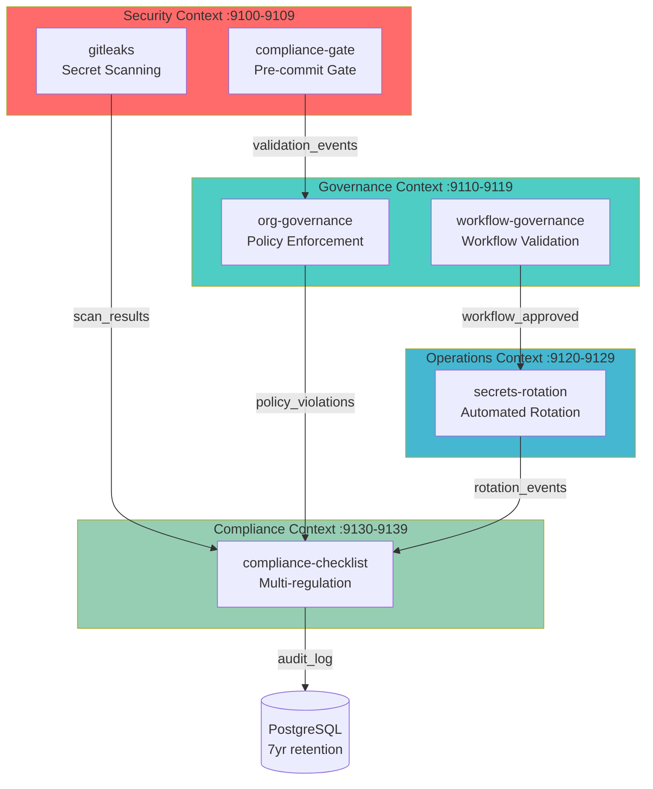

<link rel="stylesheet" href="../../../../platform-resources/styles/virons-markdown.css">

# MCP Bounded Contexts

## Overview

***

Domain-Driven Design structure for Virons MCP servers. Four bounded contexts with clear responsibilities and compliance mappings.

## Context Map

***



## Bounded Context: Security

***

**Responsibility**: Secret scanning, vulnerability detection, compliance gates

**Port Range**: 9100-9109

### Services

| Service | Port | Purpose | Events Published |
|---------|------|---------|------------------|
| **gitleaks** | 9100 | Pre-commit secret scanning | `SecretDetected`, `ScanCompleted` |
| **compliance-gate** | 9101 | Pre-commit compliance validation | `GatePassed`, `GateFailed` |

### Domain Model

```python
class SecretScanResult:
    repo: str
    commit: str
    secrets_found: List[Secret]
    timestamp: datetime
    compliance_status: ComplianceStatus

class Secret:
    type: SecretType  # API_KEY, TOKEN, PASSWORD
    location: FileLocation
    severity: Severity
    remediation: str
```

### Compliance

- **BaFin AT 8.1**: Audit trail for all scans
- **GDPR Art 32**: Security of processing (secret detection)

## Bounded Context: Governance

***

**Responsibility**: Policy enforcement, workflow validation, organizational rules

**Port Range**: 9110-9119

### Services

| Service | Port | Purpose | Events Published |
|---------|------|---------|------------------|
| **org-governance** | 9102 | Organization policy enforcement | `PolicyViolated`, `PolicyEnforced` |
| **workflow-governance** | 9103 | Workflow validation | `WorkflowApproved`, `WorkflowRejected` |

### Domain Model

```python
class Policy:
    id: str
    name: str
    rules: List[Rule]
    enforcement_level: EnforcementLevel  # BLOCKING, WARNING
    compliance_mapping: List[Regulation]

class WorkflowValidation:
    workflow_id: str
    policies_checked: List[Policy]
    violations: List[Violation]
    approved: bool
```

### Compliance

- **BaFin AT 8.1**: Change control documentation
- **GDPR Art 25**: Data protection by design
- **DORA Art 11**: ICT governance framework

## Bounded Context: Operations

***

**Responsibility**: Secret rotation, operational automation, resilience

**Port Range**: 9120-9129

### Services

| Service | Port | Purpose | Events Published |
|---------|------|---------|------------------|
| **secrets-rotation** | 9104 | Automated secret rotation | `SecretRotated`, `RotationFailed` |

### Domain Model

```python
class SecretRotation:
    secret_id: str
    rotation_date: datetime
    next_rotation: datetime
    rotation_interval: timedelta  # Max 90 days (DORA)
    status: RotationStatus

class RotationPolicy:
    max_age_days: int = 90  # DORA Art 11
    notification_days: int = 7
    auto_rotate: bool = True
```

### Compliance

- **DORA Art 11**: ICT risk management (secret rotation <90d)
- **BaFin AT 8.1**: Audit trail for credential changes

## Bounded Context: Compliance

***

**Responsibility**: Multi-regulation validation, compliance checklist, audit aggregation

**Port Range**: 9130-9139

### Services

| Service | Port | Purpose | Events Published |
|---------|------|---------|------------------|
| **compliance-checklist** | 9105 | Multi-regulation validation | `ComplianceCheckPassed`, `ComplianceCheckFailed` |

### Domain Model

```python
class ComplianceCheck:
    regulations: List[Regulation]  # BAFIN, GDPR, DORA
    checks: List[Check]
    status: ComplianceStatus
    evidence: List[Evidence]
    timestamp: datetime

class Regulation(Enum):
    BAFIN_AT_8_1 = "BaFin MaRisk AT 8.1"
    GDPR_ART_25 = "GDPR Art 25"
    GDPR_ART_32 = "GDPR Art 32"
    DORA_ART_11 = "DORA Art 11"
```

### Compliance

- **BaFin AT 8.1**: Comprehensive audit trail
- **GDPR Art 25/32**: Data protection validation
- **DORA Art 11**: ICT risk management validation

## Integration Patterns

***

### Event-Driven Communication

```python
# Security → Compliance
@event_handler("SecretDetected")
async def on_secret_detected(event: SecretDetected):
    await compliance_checklist.record_violation(
        regulation=Regulation.BAFIN_AT_8_1,
        violation=event.to_violation()
    )

# Governance → Operations
@event_handler("PolicyViolated")
async def on_policy_violated(event: PolicyViolated):
    if event.policy.requires_rotation:
        await secrets_rotation.schedule_rotation(event.secret_id)
```

### Shared Kernel

```python
# Common compliance models
from virons_mcp.shared.compliance import (
    AuditLog,
    ComplianceStatus,
    Regulation,
    Evidence
)
```

### Anti-Corruption Layer

```python
# External AWS Secrets Manager → Internal domain model
class SecretsManagerAdapter:
    async def get_secret(self, secret_id: str) -> Secret:
        aws_secret = await self.client.get_secret_value(SecretId=secret_id)
        return Secret.from_aws(aws_secret)
```

## Ubiquitous Language

***

| Term | Definition | Context |
|------|------------|---------|
| **Secret** | Sensitive credential (API key, token, password) | Security |
| **Policy** | Organizational rule with enforcement level | Governance |
| **Rotation** | Automated credential replacement | Operations |
| **Compliance Check** | Multi-regulation validation | Compliance |
| **Audit Log** | Immutable record (7yr retention) | All |
| **Violation** | Policy or regulation breach | All |

## Navigation
← [Architecture Home](../README.md)

***

**Last Updated**: 2026-03-05
**Maintained By**: platform@virons.ai
