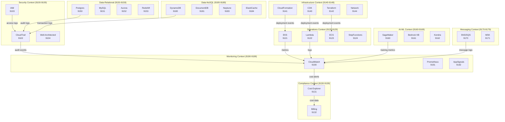

<link rel="stylesheet" href="../../../../platform-resources/styles/virons-markdown.css">

# ADR-002: AWS MCP Server Integration

**Status**: ✅ Accepted  
**Date**: 2026-03-05  
**Contexts**: All (Security, Governance, Operations, Compliance, Infrastructure, Data, AI-ML, Messaging, Monitoring)  
**Compliance**: BaFin AT 8.1, GDPR Art 25/32, DORA Art 11

## Context

***

The platform-mcp repository contains 67 AWS MCP servers from AWS Labs. We need to determine which servers to integrate into virons-mcp-server bounded contexts to support:

1. **Regulatory Compliance**: BaFin AT 8.1 (audit trail, access control), GDPR Art 25/32 (data protection by design, security of processing), DORA Art 11 (ICT risk management)
2. **Platform Operations**: Support virons-services (forensic analysis :9300-9415, ML :9420-9424, blockchain)
3. **Comprehensive Coverage**: Provide full AWS ecosystem support within port capacity constraints
4. **Operational Excellence**: Enable monitoring, troubleshooting, incident response, cost management

### Audit Methodology

We conducted a systematic audit using a weighted scoring framework:

**Scoring Dimensions** (0-10 scale):
- **Compliance Value** (weight: 3x): Direct support for BaFin AT 8.1, GDPR, DORA
- **Operational Value** (weight: 2x): Monitoring, troubleshooting, incident response
- **Platform Fit** (weight: 2x): Support for forensic analysis, ML, blockchain
- **Development Value** (weight: 1x): CI/CD, IaC, deployment automation

**Integration Tiers**:
- **Tier 1 (Core)**: Score ≥ 40 - Immediate integration
- **Tier 2 (Extended)**: Score 20-39 - Phase 2 integration
- **Tier 3 (Future)**: Score < 20 - Archive for future consideration

## Decision

***

### Integrate 40 Tier 1 AWS MCP Servers in Two Groups

We will integrate 40 AWS MCP servers (Tier 1) into virons-mcp-server, separated into two distinct groups:

**Group 1: Platform Servers (24 servers)** - Port range 9100-9149, 9190-9199
- Purpose: Development, operations, compliance, security, infrastructure, monitoring
- Users: Internal teams (platform engineers, security, compliance, operations)
- Deployment: `platform-mcp` namespace
- Cost: Platform operations budget

**Group 2: Business Logic Servers (16 servers)** - Port range 9150-9189
- Purpose: Virons AI product features (forensic analysis, ML, data services)
- Users: Virons services (:9300-9415 forensic, :9420-9424 ML)
- Deployment: `virons-services-mcp` namespace
- Cost: Product development budget

This separation ensures clear ownership, different deployment strategies, and appropriate cost allocation.

### Context Expansion

**Original Contexts** (9100-9139):
- Security (9100-9109)
- Governance (9110-9119)
- Operations (9120-9129)
- Compliance (9130-9139)

**New Contexts** (9140-9199):
- Infrastructure (9140-9149)
- Data-Relational (9150-9159)
- AI-ML (9160-9169)
- Messaging (9170-9179)
- Data-NoSQL (9180-9189)
- Monitoring (9190-9199)

### Tier 1 Server List (40 Servers)

#### GROUP 1: PLATFORM SERVERS (24 servers)

##### Security Context (3 servers)
1. **cloudtrail-mcp-server** (9102) - Score: 71 - Platform audit trail
2. **iam-mcp-server** (9103) - Score: 61 - Platform IAM management
3. **well-architected-security-mcp-server** (9104) - Score: 56 - Platform security posture

##### Operations Context (4 servers)
4. **eks-mcp-server** (9121) - Score: 54 - Platform Kubernetes management
5. **lambda-tool-mcp-server** (9122) - Score: 48 - Platform Lambda management
6. **ecs-mcp-server** (9123) - Score: 46 - Platform container orchestration
7. **stepfunctions-tool-mcp-server** (9124) - Score: 46 - Platform workflow orchestration

##### Compliance Context (2 servers)
8. **cost-explorer-mcp-server** (9131) - Score: 43 - Platform cost analysis
9. **billing-cost-management-mcp-server** (9132) - Score: 41 - Platform budget management

##### Infrastructure Context (5 servers)
10. **cfn-mcp-server** (9141) - Score: 54 - Platform CloudFormation
11. **cdk-mcp-server** (9140) - Score: 53 - Platform CDK IaC
12. **terraform-mcp-server** (9142) - Score: 52 - Platform Terraform
13. **aws-network-mcp-server** (9144) - Score: 49 - Platform VPC management
14. **aws-iac-mcp-server** (9143) - Score: 46 - Platform IaC operations

##### Monitoring Context (4 servers)
15. **cloudwatch-mcp-server** (9190) - Score: 62 - Platform monitoring
16. **prometheus-mcp-server** (9191) - Score: 51 - Platform metrics
17. **cloudwatch-appsignals-mcp-server** (9192) - Score: 52 - Platform service monitoring
18. **cloudwatch-applicationsignals-mcp-server** (9193) - Score: 45 - Platform app monitoring

##### Governance Context (2 servers - existing)
19. **org-governance** (9110) - Organization policy enforcement
20. **workflow-governance** (9111) - Workflow validation

##### Security Context (2 servers - existing)
21. **gitleaks** (9100) - Pre-commit secret scanning
22. **compliance-gate** (9101) - Pre-commit compliance checks

##### Operations Context (1 server - existing)
23. **secrets-rotation** (9120) - Platform secret rotation

##### Compliance Context (1 server - existing)
24. **compliance-checklist** (9130) - Platform compliance validation

#### GROUP 2: BUSINESS LOGIC SERVERS (16 servers)

##### Data-Relational Context (4 servers)
25. **postgres-mcp-server** (9150) - Score: 59 - Transaction data, forensic audit logs
26. **mysql-mcp-server** (9151) - Score: 52 - Application data storage
27. **aurora-dsql-mcp-server** (9152) - Score: 54 - Distributed SQL transactions
28. **redshift-mcp-server** (9153) - Score: 52 - Forensic analytics, ML feature store

##### AI-ML Context (3 servers)
29. **sagemaker-ai-mcp-server** (9160) - Score: 54 - ML training/inference (:9420-9424)
30. **bedrock-kb-retrieval-mcp-server** (9161) - Score: 46 - RAG for forensic analysis
31. **amazon-kendra-index-mcp-server** (9162) - Score: 44 - Intelligent search

##### Messaging Context (2 servers)
32. **amazon-sns-sqs-mcp-server** (9170) - Score: 49 - Business event streaming
33. **aws-msk-mcp-server** (9171) - Score: 49 - Real-time transaction ingestion

##### Data-NoSQL Context (7 servers)
34. **dynamodb-mcp-server** (9180) - Score: 57 - Transaction ledger, blockchain data
35. **documentdb-mcp-server** (9181) - Score: 40 - Transaction metadata
36. **amazon-keyspaces-mcp-server** (9182) - Score: 40 - Transaction time-series
37. **amazon-neptune-mcp-server** (9183) - Score: 42 - Fraud detection graph analysis
38. **elasticache-mcp-server** (9184) - Score: 40 - Session management, API caching
39. **s3-tables-mcp-server** (9185) - Score: 42 - Forensic data lake, ML training data
40. **valkey-mcp-server** (9186) - Score: 38 - Caching (promoted from Tier 2)

### Tier 2 Servers (25 Servers) - Phase 2 Integration

Documented in [Integration Backlog](../aws-mcp-audit/INTEGRATION-BACKLOG.md) for future consideration:
- Infrastructure & Development: 6 servers (aws-serverless, aws-api, git-repo-research, openapi, aws-diagram, code-doc-gen)
- Data Services: 4 servers (valkey, memcached, timestream-influxdb, aws-dataprocessing)
- AI/ML: 4 servers (bedrock-agentcore, bedrock-data-automation, bedrock-custom-model-import, nova-canvas)
- Messaging & Integration: 2 servers (amazon-mq, aws-appsync)
- Utilities: 9 servers (aws-documentation, aws-knowledge, aws-support, syntheticdata, document-loader, finch, core-mcp, mcp-lambda-handler, sagemaker-spark-*)

### Tier 3 Servers (8 Servers) - Archive

Low-priority servers with limited fintech relevance:
- Healthcare: aws-healthomics, healthlake, healthimaging (score: 20 each)
- IoT: aws-iot-sitewise (score: 20)
- Niche: aws-location, frontend-mcp, ccapi, amazon-qbusiness-anonymous, amazon-qindex, aws-pricing (scores: 15-19)

## Rationale

***

### 1. Compliance-First Approach

**BaFin AT 8.1** (Audit Trail, Access Control):
- CloudTrail (score: 71) - Critical for audit trail, 90-day event history, CloudTrail Lake analytics
- IAM (score: 61) - Essential for access control, policy management, security simulation
- Postgres (score: 59) - Audit log storage with 7-year retention
- Cost Explorer (score: 43) - Cost transparency and financial controls

**GDPR Art 25** (Data Protection by Design):
- IAM (score: 61) - Access control by design
- CDK/CloudFormation/Terraform (scores: 52-54) - Infrastructure by design
- Network (score: 49) - Network security by design

**GDPR Art 32** (Security of Processing):
- CloudTrail (score: 71) - Security monitoring
- All database servers (scores: 40-59) - Encryption at rest/transit
- Network (score: 49) - Network security

**DORA Art 11** (ICT Risk Management):
- CloudWatch (score: 62) - Operational resilience monitoring
- Well-Architected Security (score: 56) - Risk assessment
- EKS/Lambda/ECS (scores: 46-54) - Infrastructure resilience

### 2. Platform Alignment

**Forensic Analysis** (:9300-9415):
- CloudTrail (score: 71) - Event correlation, anomaly detection
- Postgres (score: 59) - Forensic data storage
- DynamoDB (score: 57) - Transaction data
- Neptune (score: 42) - Graph-based fraud detection

**ML Services** (:9420-9424):
- SageMaker (score: 54) - Model training/inference
- Redshift (score: 52) - ML feature store
- Bedrock KB (score: 46) - RAG for ML pipelines
- Kendra (score: 44) - Intelligent search

**Blockchain** (future):
- DynamoDB (score: 57) - Distributed ledger support
- Neptune (score: 42) - Transaction graph analysis

### 3. Operational Excellence

**Incident Response**:
- CloudWatch (score: 62) - Alarm troubleshooting, log analysis
- CloudTrail (score: 71) - Security investigations
- Prometheus (score: 51) - Metrics and alerting

**Infrastructure Management**:
- EKS (score: 54) - Container orchestration
- Lambda (score: 48) - Serverless compute
- CDK/CloudFormation/Terraform (scores: 52-54) - IaC deployment

**Cost Management**:
- Cost Explorer (score: 43) - Cost analysis, forecasting
- Billing (score: 41) - Budget management

### 4. Scalability and Future-Proofing

- 10 bounded contexts with 10 ports each = 100 total capacity
- 39 ports allocated (39%), 61 ports reserved (61%)
- Room for Tier 2 integration (25 servers) and future growth
- Clear context boundaries for team ownership

## Consequences

***

### Positive

✅ **Compliance Coverage**: Full support for BaFin AT 8.1, GDPR Art 25/32, DORA Art 11  
✅ **Platform Alignment**: Direct support for forensic analysis, ML, blockchain  
✅ **Operational Excellence**: Comprehensive monitoring, troubleshooting, incident response  
✅ **Developer Experience**: Full IaC support (CDK, CloudFormation, Terraform)  
✅ **Data Services**: Complete database coverage (relational, NoSQL, graph, cache)  
✅ **Scalability**: 61 reserved ports for future expansion  
✅ **Clear Ownership**: 10 bounded contexts with clear responsibilities

### Negative

⚠️ **Increased Complexity**: 10 contexts vs. 4 original contexts  
⚠️ **Documentation Overhead**: Must maintain 33 server configurations  
⚠️ **Testing Burden**: Integration testing for 33 servers  
⚠️ **Operational Overhead**: Monitoring and maintaining 33 services  
⚠️ **Port Range Expansion**: Firewall rules must cover 9100-9199 (vs. 9100-9139)

### Neutral

- Tier 2 servers (25) documented for Phase 2 integration
- Tier 3 servers (8) archived for future consideration
- Healthcare/IoT servers excluded (not fintech-relevant)
- Port allocation must be coordinated with platform team

## Implementation

***

### Phase 1: Core Integration (Q2 2026)

**Priority 1** (Compliance-Critical):
- Security Context: CloudTrail, IAM, Well-Architected Security
- Compliance Context: Cost Explorer, Billing
- Monitoring Context: CloudWatch, Prometheus

**Priority 2** (Operations-Critical):
- Operations Context: EKS, Lambda, ECS, Step Functions
- Monitoring Context: Application Signals

**Priority 3** (Infrastructure):
- Infrastructure Context: CDK, CloudFormation, Terraform, Network

### Phase 2: Data & AI/ML (Q3 2026)

**Priority 4** (Data Services):
- Data-Relational Context: Postgres, MySQL, Aurora, Redshift
- Data-NoSQL Context: DynamoDB, DocumentDB, Keyspaces, Neptune, ElastiCache, S3 Tables

**Priority 5** (AI/ML):
- AI-ML Context: SageMaker, Bedrock KB, Kendra

### Phase 3: Messaging (Q4 2026)

**Priority 6** (Messaging):
- Messaging Context: SNS/SQS, MSK

### Integration Checklist (Per Server)

- [ ] Create Helm chart in `infrastructure/kind/helm/`
- [ ] Add to Kind setup script (`infrastructure/kind/kind-setup.sh`)
- [ ] Configure IAM permissions (least privilege)
- [ ] Add to QUICKSTART.md with usage examples
- [ ] Create operational runbook in `docs/operations/runbooks/`
- [ ] Add compliance documentation (BaFin/GDPR/DORA mapping)
- [ ] Configure network policies (context-based)
- [ ] Add monitoring/alerting (CloudWatch, Prometheus)
- [ ] Write integration tests
- [ ] Update port registry in ADR-001

## Compliance Mapping

***

| Regulation | Requirement | Tier 1 Servers | Implementation |
|------------|-------------|----------------|----------------|
| **BaFin AT 8.1** | Audit trail | CloudTrail, Postgres | 90-day event history, 7-year log retention |
| **BaFin AT 8.1** | Access control | IAM | Policy management, MFA, least privilege |
| **BaFin AT 8.1** | Monitoring | CloudWatch, Prometheus | Metrics, logs, alarms, dashboards |
| **BaFin AT 8.1** | Cost transparency | Cost Explorer, Billing | Cost analysis, budget alerts, forecasting |
| **GDPR Art 25** | Data protection by design | IAM, CDK, CloudFormation, Terraform | Access control, IaC, network security |
| **GDPR Art 32** | Encryption at rest | All DB servers | KMS encryption, TLS 1.3 |
| **GDPR Art 32** | Security monitoring | CloudTrail, CloudWatch | Event logging, alarm notifications |
| **DORA Art 11** | Operational resilience | CloudWatch, Prometheus, EKS, Lambda | Monitoring, auto-scaling, multi-AZ |
| **DORA Art 11** | Incident detection | CloudTrail, Well-Architected Security | Security Hub, GuardDuty integration |
| **DORA Art 11** | ICT risk management | Well-Architected Security | Risk assessment, compliance checks |

## Architecture Diagram

***

## Alternatives Considered

***

### Alternative 1: Integrate All 67 Servers

- **Pros**: Complete AWS coverage
- **Cons**: Port exhaustion, operational overhead, many low-value servers
- **Rejected**: Tier 3 servers (healthcare, IoT) not fintech-relevant

### Alternative 2: Integrate Only Top 10 Servers

- **Pros**: Minimal complexity, easy to manage
- **Cons**: Insufficient coverage for compliance, operations, data services
- **Rejected**: Missing critical servers (databases, IaC, messaging)

### Alternative 3: Keep 4 Original Contexts

- **Pros**: Simple, no context expansion
- **Cons**: Port exhaustion (>10 servers per context), poor separation of concerns
- **Rejected**: Violates bounded context principles

### Alternative 4: Create 20 Micro-Contexts

- **Pros**: Fine-grained separation
- **Cons**: Over-engineering, port fragmentation, operational complexity
- **Rejected**: Diminishing returns, hard to manage

## References

***

- [Server Catalog](../aws-mcp-audit/SERVER-CATALOG.md)
- [Scoring Framework](../aws-mcp-audit/SCORING-FRAMEWORK.md)
- [Server Scores](../aws-mcp-audit/SERVER-SCORES.md)
- [Context Mapping](../aws-mcp-audit/CONTEXT-MAPPING.md)
- [Integration Backlog](../aws-mcp-audit/INTEGRATION-BACKLOG.md)
- [ADR-001: Port Allocation](ADR-001-port-allocation.md)
- [BaFin AT 8.1 Compliance](../../compliance/bafin/BAFIN-AT-8.1.md)
- [GDPR Art 25/32 Compliance](../../compliance/gdpr/GDPR-ART-25-32.md)
- [DORA Art 11 Compliance](../../compliance/dora/DORA-ART-11.md)

## Navigation
← [ADRs Home](README.md) | [ADR-001](ADR-001-port-allocation.md) →

***

**Last Updated**: 2026-03-05  
**Author**: platform@virons.ai  
**Reviewers**: security@virons.ai, compliance@virons.ai, operations@virons.ai
