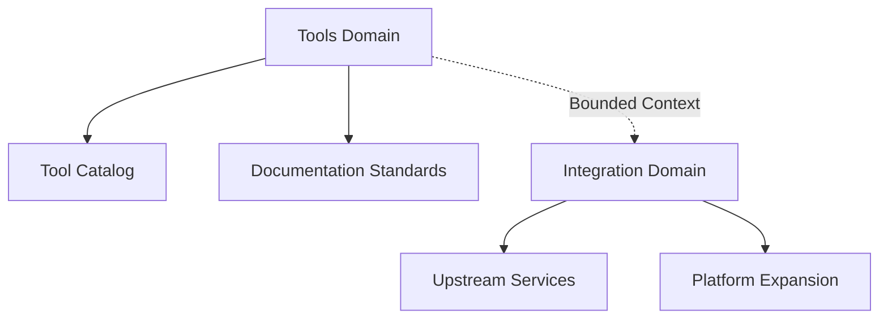

<link rel="stylesheet" href="../../platform-resources/styles/virons-markdown.css">
<button onclick="const t=document.body.classList.toggle('theme-light');localStorage.setItem('theme',t?'light':'dark')" style="position:fixed;top:1rem;right:1rem;padding:0.5rem 1rem;border-radius:6px;border:1px solid var(--color-border);background:var(--color-code-bg);color:var(--color-text);cursor:pointer;z-index:1000;">Toggle Theme</button>
<script>if(localStorage.getItem('theme')==='light')document.body.classList.add('theme-light')</script>

# Domain Layer

## Overview

***

Core business concepts, rules, and domain logic independent of technical implementation. Foundation of the DDD architecture containing tools and integration patterns.

| Category | Description |
|----------|-------------|
| **Audience** | Developers, architects, domain experts |
| **Purpose** | Define core business concepts and domain rules |
| **Domain** | `virons.ai/platform-mcp/domain` |
| **Context** | Domain layer in DDD architecture |
| **Status** | **Active** |

## Architecture

***

**Domain-Driven Design**: Ubiquitous language, bounded contexts, and domain events define the core business logic.

**Diagram**:

***



## Contents

***

```
domain/
├── tools/                  # Tool domain
│   ├── TOOL_CATALOG.md
│   ├── TOOL_DOCUMENTATION_STANDARD.md
│   └── TOOL_DOCUMENTATION_IMPROVEMENTS.md
├── integration/            # Integration domain
│   ├── AWSLABS_INTEGRATION.md
│   ├── AWSLABS_DEPLOYMENT_PLAN.md
│   ├── AWSLABS_QUICK_REFERENCE.md
│   ├── UPSTREAM_INTEGRATION.md
│   ├── MCP_EXPANSION_PLAN.md
│   └── MCP-SERVER-ORCHESTRATOR-MAPPING.md
└── README.md              # This file
```

## Key Features

***

- **Ubiquitous Language**: Consistent terminology across all documentation
- **Bounded Contexts**: Clear boundaries between tools and integration domains
- **Domain Events**: Key events and state transitions documented
- **Aggregates**: Related concepts grouped together

## Domains

***

### [Tools Domain](tools/)

**Purpose**: Define what tools exist and their capabilities

**Key Documents**:
- [Tool Catalog](tools/TOOL_CATALOG.md) - Complete catalog of all 90 MCP tools
- [Tool Documentation Standard](tools/TOOL_DOCUMENTATION_STANDARD.md) - Standards for tool documentation
- [Tool Documentation Improvements](tools/TOOL_DOCUMENTATION_IMPROVEMENTS.md) - Enhancement summary

**Responsibilities**:
- Tool definitions and specifications
- Documentation standards
- Tool discovery and selection
- Parameter validation rules

### [Integration Domain](integration/)

**Purpose**: Define integration boundaries and upstream service contracts

**Key Documents**:
- [AWS Labs Integration](integration/AWSLABS_INTEGRATION.md) - AWS Labs MCP server integration
- [AWS Labs Deployment Plan](integration/AWSLABS_DEPLOYMENT_PLAN.md) - Deployment strategy
- [AWS Labs Quick Reference](integration/AWSLABS_QUICK_REFERENCE.md) - Quick reference guide
- [Upstream Integration](integration/UPSTREAM_INTEGRATION.md) - Upstream service patterns
- [MCP Expansion Plan](integration/MCP_EXPANSION_PLAN.md) - Platform expansion strategy
- [MCP Server Orchestrator Mapping](integration/MCP-SERVER-ORCHESTRATOR-MAPPING.md) - Server orchestration

**Responsibilities**:
- Integration patterns and contracts
- Upstream service dependencies
- Platform expansion planning
- Service orchestration rules

## DDD Principles

***

| Principle | Implementation |
|-----------|----------------|
| **Ubiquitous Language** | Consistent terminology (tool, stack, deployment, etc.) |
| **Bounded Contexts** | Clear separation: tools vs integration |
| **Domain Events** | Tool invocation, deployment events, drift detection |
| **Aggregates** | Tool + documentation + examples as single unit |
| **Value Objects** | Tool parameters, configuration values |
| **Entities** | Tools, stacks, deployments with identity |

## Relationship to Other Layers

***

- **Application Layer**: Uses domain concepts to implement workflows
- **Infrastructure Layer**: Provides technical implementation of domain concepts
- **Architecture**: Defines system-wide patterns spanning all layers

## Navigation

← [Documentation Index](../INDEX.md) | [Application Layer](../application/README.md) →

***

**Last Updated**: 2026-03-07

**Maintained By**: platform-team@virons.ai
