# Upstream MCP Server Integration Guide

## Overview

The 3 orchestrator MCP servers (Monitoring, Security, Operations) integrate with 15 upstream AWS MCP servers via HTTP. This document explains how to deploy and test with both mock and real upstream servers.

## Architecture

```mermaid
graph TB
  subgraph "Orchestrator Layer :9500-:9520"
    Monitoring[Monitoring MCP :9520]
    Security[Security MCP :9500]
    Operations[Operations MCP :9510]
  end
  
  subgraph "Monitoring Upstreams :9109-:9112"
    CloudWatch[CloudWatch :9109]
    Prometheus[Prometheus :9110]
    Grafana[Grafana :9111]
    Elasticsearch[Elasticsearch :9112]
  end
  
  subgraph "Security Upstreams :9100-:9104"
    Gitleaks[Gitleaks :9100]
    ComplianceGate[Compliance Gate :9101]
    CloudTrail[CloudTrail :9102]
    IAM[IAM :9103]
    WellArchitected[Well-Architected :9104]
  end
  
  subgraph "Operations Upstreams :9121-:9126"
    EKS[EKS :9121]
    Lambda[Lambda :9122]
    ECS[ECS :9123]
    StepFunctions[StepFunctions :9124]
    EC2[EC2 :9125]
    S3[S3 :9126]
  end
  
  Monitoring --> CloudWatch
  Monitoring --> Prometheus
  Monitoring --> Grafana
  Monitoring --> Elasticsearch
  
  Security --> Gitleaks
  Security --> ComplianceGate
  Security --> CloudTrail
  Security --> IAM
  Security --> WellArchitected
  
  Operations --> EKS
  Operations --> Lambda
  Operations --> ECS
  Operations --> StepFunctions
  Operations --> EC2
  Operations --> S3
```



## Upstream Server Ports

### Monitoring Upstreams
- CloudWatch: `9109`
- Prometheus: `9110`
- Grafana: `9111`
- Elasticsearch: `9112`

### Security Upstreams
- Gitleaks: `9100`
- Compliance Gate: `9101`
- CloudTrail: `9102`
- IAM: `9103`
- Well-Architected: `9104`

### Operations Upstreams
- EKS: `9121`
- Lambda: `9122`
- ECS: `9123`
- StepFunctions: `9124`
- EC2: `9125`
- S3: `9126`

## Mock Upstream Setup (Development)

For local development and testing without AWS credentials.

### 1. Create Mock Server

```python
# src/virons-common/virons/common/mock_upstream_server.py
from fastapi import FastAPI, Request
import uvicorn
import sys

app = FastAPI()

@app.get("/health")
async def health():
    return {"status": "healthy"}

@app.get("/tools/list")
async def list_tools():
    """Return mock tool list."""
    return {
        "tools": [
            {"name": "describe_instances", "description": "Mock EC2 describe"},
            {"name": "list_functions", "description": "Mock Lambda list"},
            {"name": "list_buckets", "description": "Mock S3 list"},
        ]
    }

@app.post("/tools/{tool_name}")
async def call_tool(tool_name: str, request: Request):
    """Generic mock handler for any tool."""
    body = await request.json()
    return {
        "status": "success",
        "tool": tool_name,
        "mock": True,
        "input": body,
        "result": {"message": f"Mock response for {tool_name}"}
    }

if __name__ == "__main__":
    port = int(sys.argv[1]) if len(sys.argv) > 1 else 9000
    print(f"Starting mock upstream on port {port}")
    uvicorn.run(app, host="0.0.0.0", port=port)
```

### 2. Start All Mock Upstreams

```bash
# Start monitoring upstreams
python3 src/virons-common/virons/common/mock_upstream_server.py 9109 &  # CloudWatch
python3 src/virons-common/virons/common/mock_upstream_server.py 9110 &  # Prometheus
python3 src/virons-common/virons/common/mock_upstream_server.py 9111 &  # Grafana
python3 src/virons-common/virons/common/mock_upstream_server.py 9112 &  # Elasticsearch

# Start security upstreams
python3 src/virons-common/virons/common/mock_upstream_server.py 9100 &  # Gitleaks
python3 src/virons-common/virons/common/mock_upstream_server.py 9101 &  # Compliance Gate
python3 src/virons-common/virons/common/mock_upstream_server.py 9102 &  # CloudTrail
python3 src/virons-common/virons/common/mock_upstream_server.py 9103 &  # IAM
python3 src/virons-common/virons/common/mock_upstream_server.py 9104 &  # Well-Architected

# Start operations upstreams
python3 src/virons-common/virons/common/mock_upstream_server.py 9121 &  # EKS
python3 src/virons-common/virons/common/mock_upstream_server.py 9122 &  # Lambda
python3 src/virons-common/virons/common/mock_upstream_server.py 9123 &  # ECS
python3 src/virons-common/virons/common/mock_upstream_server.py 9124 &  # StepFunctions
python3 src/virons-common/virons/common/mock_upstream_server.py 9125 &  # EC2
python3 src/virons-common/virons/common/mock_upstream_server.py 9126 &  # S3
```

### 3. Start Orchestrator Servers

```bash
# Start monitoring MCP
cd src/virons-monitoring-mcp-server
python3 -m virons.monitoring_mcp_server.server &

# Start security MCP
cd src/virons-security-mcp-server
python3 -m virons.security_mcp_server.server &

# Start operations MCP
cd src/virons-operations-mcp-server
python3 -m virons.operations_mcp_server.server &
```

### 4. Test Integration

```bash
# Test monitoring MCP
curl http://localhost:9520/health
curl http://localhost:9520/tools | jq

# Test security MCP
curl http://localhost:9500/health
curl http://localhost:9500/tools | jq

# Test operations MCP
curl http://localhost:9510/health
curl http://localhost:9510/tools | jq
```

## Real Upstream Deployment (Production)

For production deployment with real AWS services.

### 1. Deploy Upstream Servers

Each upstream server needs AWS credentials and proper IAM permissions.

```yaml
# docker-compose.yml
services:
  cloudwatch-mcp:
    image: virons/cloudwatch-mcp:latest
    ports:
      - "9109:9109"
    environment:
      - AWS_REGION=us-east-1
      - AWS_ACCESS_KEY_ID=${AWS_ACCESS_KEY_ID}
      - AWS_SECRET_ACCESS_KEY=${AWS_SECRET_ACCESS_KEY}
    
  iam-mcp:
    image: virons/iam-mcp:latest
    ports:
      - "9103:9103"
    environment:
      - AWS_REGION=us-east-1
      - AWS_ACCESS_KEY_ID=${AWS_ACCESS_KEY_ID}
      - AWS_SECRET_ACCESS_KEY=${AWS_SECRET_ACCESS_KEY}
  
  # ... repeat for all 15 upstreams
```

### 2. Configure IAM Permissions

Each upstream needs specific IAM permissions:

**CloudWatch:**
```json
{
  "Version": "2012-10-17",
  "Statement": [{
    "Effect": "Allow",
    "Action": [
      "cloudwatch:PutMetricData",
      "cloudwatch:GetMetricData",
      "cloudwatch:DescribeAlarms",
      "cloudwatch:PutMetricAlarm"
    ],
    "Resource": "*"
  }]
}
```

**IAM:**
```json
{
  "Version": "2012-10-17",
  "Statement": [{
    "Effect": "Allow",
    "Action": [
      "iam:GetPolicy",
      "iam:CreatePolicy",
      "iam:AttachRolePolicy",
      "iam:SimulatePrincipalPolicy"
    ],
    "Resource": "*"
  }]
}
```

**EC2:**
```json
{
  "Version": "2012-10-17",
  "Statement": [{
    "Effect": "Allow",
    "Action": [
      "ec2:DescribeInstances",
      "ec2:StartInstances",
      "ec2:StopInstances"
    ],
    "Resource": "*"
  }]
}
```

### 3. Environment Configuration

```bash
# .env
AWS_REGION=us-east-1
AWS_ACCOUNT_ID=123456789012

# Monitoring upstreams
CLOUDWATCH_MCP_URL=http://cloudwatch-mcp:9109
PROMETHEUS_MCP_URL=http://prometheus-mcp:9110
GRAFANA_MCP_URL=http://grafana-mcp:9111
ELASTICSEARCH_MCP_URL=http://elasticsearch-mcp:9112

# Security upstreams
GITLEAKS_MCP_URL=http://gitleaks-mcp:9100
COMPLIANCE_GATE_MCP_URL=http://compliance-gate-mcp:9101
CLOUDTRAIL_MCP_URL=http://cloudtrail-mcp:9102
IAM_MCP_URL=http://iam-mcp:9103
WELL_ARCHITECTED_MCP_URL=http://well-architected-mcp:9104

# Operations upstreams
EKS_MCP_URL=http://eks-mcp:9121
LAMBDA_MCP_URL=http://lambda-mcp:9122
ECS_MCP_URL=http://ecs-mcp:9123
STEPFUNCTIONS_MCP_URL=http://stepfunctions-mcp:9124
EC2_MCP_URL=http://ec2-mcp:9125
S3_MCP_URL=http://s3-mcp:9126
```

### 4. Deploy with Docker Compose

```bash
# Start all services
docker-compose up -d

# Check health
docker-compose ps
docker-compose logs -f
```

## Testing Procedures

### 1. Health Check All Services

```bash
#!/bin/bash
# scripts/health-check-all.sh

PORTS=(9109 9110 9111 9112 9100 9101 9102 9103 9104 9121 9122 9123 9124 9125 9126 9500 9510 9520)

for port in "${PORTS[@]}"; do
  echo -n "Port $port: "
  curl -s http://localhost:$port/health | jq -r '.status' || echo "FAILED"
done
```

### 2. Test Tool Discovery

```bash
# Test monitoring MCP discovers upstream tools
curl http://localhost:9520/tools | jq '.tools | length'
# Expected: 62+ tools

# Test security MCP discovers upstream tools
curl http://localhost:9500/tools | jq '.tools | length'
# Expected: 64+ tools

# Test operations MCP discovers upstream tools
curl http://localhost:9510/tools | jq '.tools | length'
# Expected: 66+ tools
```

### 3. Test Core Tools

```bash
# Test monitoring - put_metric_data
curl -X POST http://localhost:9520/tools/put_metric_data \
  -H "Content-Type: application/json" \
  -d '{
    "namespace": "TestApp",
    "metric_data": [{
      "name": "TestMetric",
      "value": 42.0,
      "unit": "Count"
    }]
  }' | jq

# Test security - create_policy
curl -X POST http://localhost:9500/tools/create_policy \
  -H "Content-Type: application/json" \
  -d '{
    "policy_name": "TestPolicy",
    "policy_document": "{\"Version\":\"2012-10-17\"}"
  }' | jq

# Test operations - describe_instances
curl -X POST http://localhost:9510/tools/describe_instances \
  -H "Content-Type: application/json" \
  -d '{}' | jq
```

### 4. Test Proxy Tools

```bash
# Test proxy tool forwarding
curl -X POST http://localhost:9520/tools/list_metrics \
  -H "Content-Type: application/json" \
  -d '{"namespace": "AWS/EC2"}' | jq

# Verify correlation ID propagation
curl -X POST http://localhost:9520/tools/query_metrics \
  -H "Content-Type: application/json" \
  -H "X-Correlation-ID: test-123" \
  -d '{
    "metric_name": "CPUUtilization",
    "start_time": "2026-03-07T00:00:00Z",
    "end_time": "2026-03-07T01:00:00Z"
  }' | jq
```

### 5. Test Audit Trails

```bash
# Test write operation creates audit trail
curl -X POST http://localhost:9510/tools/start_instances \
  -H "Content-Type: application/json" \
  -d '{"instance_ids": ["i-1234567890abcdef0"]}' | jq

# Verify audit_id in response
# Expected: {"status": "success", "audit_id": "...", ...}
```

## Troubleshooting

### Upstream Connection Failed

```bash
# Check upstream is running
curl http://localhost:9109/health

# Check network connectivity
docker network inspect platform-mcp_default

# Check logs
docker-compose logs cloudwatch-mcp
```

### Tool Not Found

```bash
# Verify tool is registered
curl http://localhost:9520/tools | jq '.tools[] | select(.name == "put_metric_data")'

# Check upstream provides tool
curl http://localhost:9109/tools | jq '.tools[] | select(.name == "put_metric_data")'
```

### AWS Credentials Error

```bash
# Verify credentials are set
docker-compose exec cloudwatch-mcp env | grep AWS

# Test AWS access
docker-compose exec cloudwatch-mcp aws sts get-caller-identity
```

### Correlation ID Not Propagating

```bash
# Check logs for correlation ID
docker-compose logs -f monitoring-mcp | grep correlation_id

# Verify upstream receives correlation ID
docker-compose logs -f cloudwatch-mcp | grep correlation_id
```

## Performance Tuning

### Connection Pooling

```python
# infrastructure/upstream_client.py
import httpx

class UpstreamClient:
    def __init__(self):
        self.client = httpx.AsyncClient(
            timeout=30.0,
            limits=httpx.Limits(max_connections=100, max_keepalive_connections=20)
        )
```

### Caching

```python
# Add caching for read-only tools
from functools import lru_cache

@lru_cache(maxsize=1000)
async def get_cached_tool_list(upstream: str):
    return await discover_tools(upstream)
```

### Rate Limiting

```python
# Add rate limiting for write operations
from aiolimiter import AsyncLimiter

rate_limiter = AsyncLimiter(max_rate=10, time_period=1)

async def write_operation():
    async with rate_limiter:
        await upstream.call_tool(...)
```

## Monitoring & Observability

### Metrics to Track

- Tool call latency (p50, p95, p99)
- Upstream health status
- Error rates per tool
- Correlation ID coverage
- Audit trail creation rate

### Logging

```python
# Structured logging for all tool calls
logger.info(
    "tool_call",
    extra={
        "tool_name": tool_name,
        "upstream": upstream_name,
        "correlation_id": correlation_id,
        "duration_ms": duration,
        "status": "success"
    }
)
```

### Alerting

- Alert on upstream health check failures
- Alert on high error rates (>5%)
- Alert on slow tool calls (>5s)
- Alert on missing correlation IDs

## Security Considerations

1. **Authentication:** All upstream calls should use service-to-service auth
2. **Encryption:** Use TLS for all upstream communication
3. **Secrets:** Store AWS credentials in secrets manager
4. **Audit:** All write operations must create audit trails
5. **Rate Limiting:** Prevent abuse with rate limits

## Conclusion

This guide covers both mock and real upstream deployment. For development, use mock upstreams. For production, deploy real AWS MCP servers with proper IAM permissions and monitoring.
