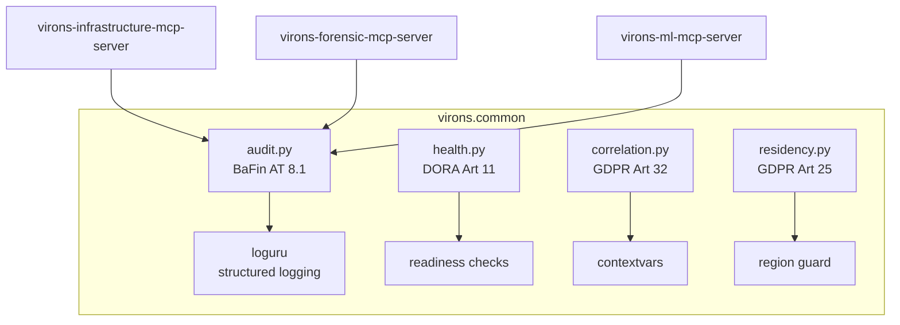

# virons.common

## Overview

***

Shared compliance utilities for all Virons AI MCP servers. Every virons MCP server depends on this package for regulatory-compliant audit logging, health checks, correlation ID threading, and data residency enforcement.

**Production-ready compliance foundation for the Virons AI platform.** Deployed in eu-central-1 — BaFin/DORA/GDPR/EU AI Act compliant.

| Category | Description |
|----------|-------------|
| **Audience** | Virons MCP server developers |
| **Purpose** | Shared compliance baseline — audit, health, correlation, residency |
| **Domain** | `virons.common` |
| **Context** | Compliance Domain (DDD) |
| **Status** | **Active** |
| **Provider** | Virons Fintech |

## Architecture

***



## Contents

***

```
virons-common/
├── virons/                     # PEP 420 namespace root
│   └── common/                 # Compliance modules
│       ├── __init__.py         # Exports + __version__
│       └── audit.py            # BaFin MaRisk AT 8.1
├── tests/                      # TDD test suite
│   ├── test_init.py            # Version + reload
│   └── test_audit.py           # Audit compliance
├── pyproject.toml              # hatchling build
├── COMPLIANCE.md               # Regulatory traceability
├── CHANGELOG.md
├── LICENSE                     # Apache-2.0
└── NOTICE                      # Virons Fintech + awslabs
```

## Key Features

***

- **BaFin MaRisk AT 8.1**: `write_audit()` — immutable audit trail, calculation_audit before forensic_flags ordering
- **DORA Art 11**: `HealthCheck` — liveness/readiness probes for ICT continuity (planned)
- **GDPR Art 32**: `CorrelationContext` — request traceability via correlation_id threading (planned)
- **GDPR Art 25**: `enforce_region()` — data residency guard, eu-central-1 only (planned)

## Usage

***

```python
from virons.common.audit import write_audit

audit_id = await write_audit(
    service_name='forensic',
    calculation_type='beneish',
    entity_id='entity-001',
    input_data={'score': 1.0},
    output_data={'flag': True},
)
```

## Dependencies

***

| Dep | Purpose | Compliance |
|-----|---------|------------|
| loguru | Structured audit logging | BaFin AT 8.1 immutable trail |
| pydantic | Data validation | Input/output schema enforcement |

## Testing

***

```bash
cd src/virons-common
uv sync
uv run pytest --cov --cov-branch --cov-report=term-missing -v
```

7 tests, 100% coverage.

## Security & Compliance

***

| Regulation | Requirement | Implementation | Reference |
|------------|-------------|----------------|-----------|
| **BaFin MaRisk AT 8.1** | Audit trail | `audit.py` — `write_audit()` | [MaRisk (BA) 09/2017](https://www.bafin.de/SharedDocs/Veroeffentlichungen/DE/Rundschreiben/2017/rs_1709_marisk_ba.html) |
| **GDPR Art 32** | Security of processing | `residency.py`, `correlation.py` | [Regulation (EU) 2016/679](https://eur-lex.europa.eu/eli/reg/2016/679/oj) |
| **DORA Art 11** | ICT response & recovery | `health.py` | [Regulation (EU) 2022/2554](https://eur-lex.europa.eu/eli/reg/2022/2554/oj) |
| **EU AI Act Art 11** | Technical documentation | `audit.py` (model card checks) | [Regulation (EU) 2024/1689](https://eur-lex.europa.eu/eli/reg/2024/1689/oj) |

See [COMPLIANCE.md](COMPLIANCE.md) for detailed regulatory traceability.

## Navigation

← [platform-mcp](../../)

***

**Last Updated**: 2026-03-04

**Maintained By**: compliance@virons.ai

## License

Apache-2.0. See [LICENSE](LICENSE) and [NOTICE](NOTICE).
