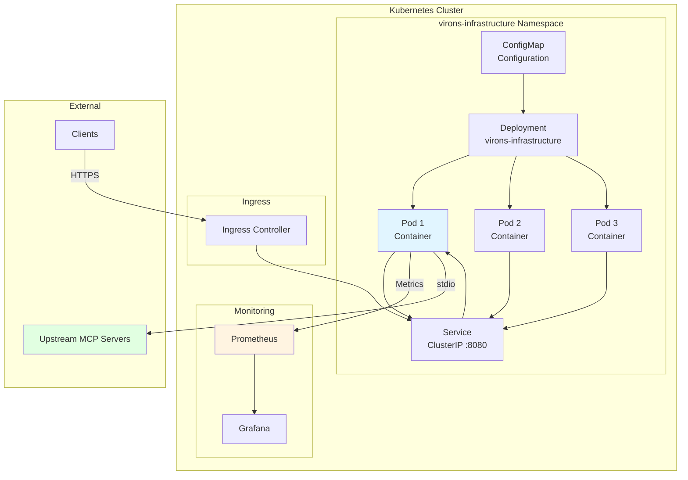
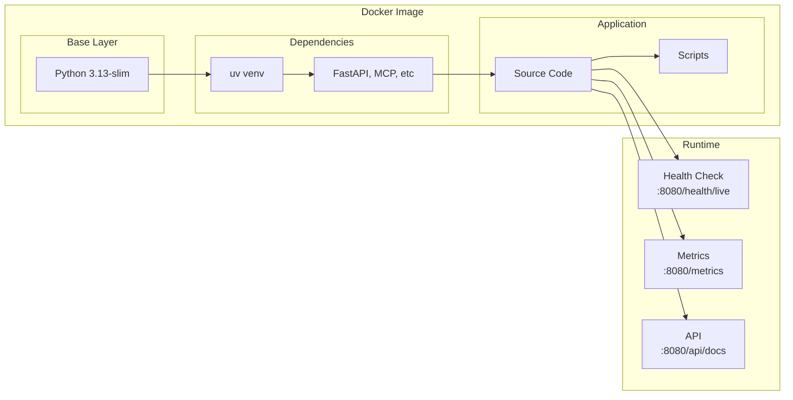

# Deployment Architecture

## Kubernetes Deployment



## Container Architecture



## Multi-Stage Build

```dockerfile
# Stage 1: Builder
FROM python:3.13-slim AS builder
- Install uv
- Copy source code
- Install dependencies
- Create virtual environment

# Stage 2: Runtime
FROM python:3.13-slim
- Copy venv from builder
- Copy application code
- Expose port 8080
- Health check
- Run server
```

## Helm Chart Structure

```
helm/virons-infrastructure/
├── Chart.yaml              # Chart metadata
├── values.yaml             # Default values
└── templates/
    ├── deployment.yaml     # Deployment spec
    ├── service.yaml        # Service spec
    ├── configmap.yaml      # Configuration
    └── _helpers.tpl        # Template helpers
```

## Resource Allocation

| Resource | Request | Limit | Purpose |
|----------|---------|-------|---------|
| CPU | 100m | 500m | API processing |
| Memory | 128Mi | 512Mi | Application runtime |
| Storage | - | - | Ephemeral only |

## Health Checks

### Liveness Probe
```yaml
livenessProbe:
  httpGet:
    path: /health/live
    port: 8080
  initialDelaySeconds: 10
  periodSeconds: 30
  timeoutSeconds: 3
  failureThreshold: 3
```

### Readiness Probe
```yaml
readinessProbe:
  httpGet:
    path: /health/ready
    port: 8080
  initialDelaySeconds: 5
  periodSeconds: 10
  timeoutSeconds: 3
  failureThreshold: 3
```

## Scaling Strategy

### Horizontal Pod Autoscaler (HPA)
```yaml
minReplicas: 2
maxReplicas: 10
targetCPUUtilizationPercentage: 70
targetMemoryUtilizationPercentage: 80
```

### Vertical Pod Autoscaler (VPA)
- Automatic resource adjustment
- Based on historical usage
- Recommendations only (manual apply)

## Network Policies

```yaml
# Allow ingress from ingress controller
- from:
  - namespaceSelector:
      matchLabels:
        name: ingress-nginx
  ports:
  - protocol: TCP
    port: 8080

# Allow egress to upstream MCP servers
- to:
  - namespaceSelector:
      matchLabels:
        name: mcp-servers
  ports:
  - protocol: TCP
    port: 9140-9143
```

## Service Mesh Integration

### Istio (Optional)
```yaml
apiVersion: networking.istio.io/v1beta1
kind: VirtualService
metadata:
  name: virons-infrastructure
spec:
  hosts:
  - virons-infrastructure
  http:
  - route:
    - destination:
        host: virons-infrastructure
        port:
          number: 8080
    timeout: 30s
    retries:
      attempts: 3
      perTryTimeout: 10s
```

## Deployment Environments

### Development
- Single replica
- Minimal resources
- Debug logging enabled
- Local upstream servers

### Staging
- 2 replicas
- Standard resources
- Info logging
- Staging upstream servers

### Production
- 3+ replicas
- Full resources
- Warning logging
- Production upstream servers
- HPA enabled
- Network policies enforced

## Deployment Process

```mermaid
graph LR
    BUILD[Build Image] --> TEST[Run Tests]
    TEST --> PUSH[Push to Registry]
    PUSH --> DEPLOY_DEV[Deploy to Dev]
    DEPLOY_DEV --> VERIFY_DEV[Verify Dev]
    VERIFY_DEV --> DEPLOY_STAGE[Deploy to Staging]
    DEPLOY_STAGE --> VERIFY_STAGE[Verify Staging]
    VERIFY_STAGE --> DEPLOY_PROD[Deploy to Production]
    DEPLOY_PROD --> VERIFY_PROD[Verify Production]

    style BUILD fill:#e1f5ff
    style DEPLOY_PROD fill:#e1ffe1
```



## Rollback Strategy

```bash
# Rollback to previous version
helm rollback virons-infrastructure

# Rollback to specific revision
helm rollback virons-infrastructure 3

# Check rollout status
kubectl rollout status deployment/virons-infrastructure

# Undo rollout
kubectl rollout undo deployment/virons-infrastructure
```

## Monitoring Integration

### Prometheus ServiceMonitor
```yaml
apiVersion: monitoring.coreos.com/v1
kind: ServiceMonitor
metadata:
  name: virons-infrastructure
spec:
  selector:
    matchLabels:
      app: virons-infrastructure
  endpoints:
  - port: http
    path: /metrics
    interval: 30s
```

### Grafana Dashboard
- Request rate
- Error rate
- Response time (p50, p95, p99)
- Resource utilization
- Upstream health status

## Disaster Recovery

### Backup
- Configuration: Stored in Git
- Audit logs: Replicated to S3 (10-year retention)
- Metrics: Prometheus remote write

### Recovery
- Redeploy from Helm chart
- Restore configuration from Git
- Audit logs remain in S3
- Metrics restored from remote storage

## Security Hardening

- Non-root container user
- Read-only root filesystem
- No privileged escalation
- Security context constraints
- Network policies
- Pod security policies
- TLS for all external communication
