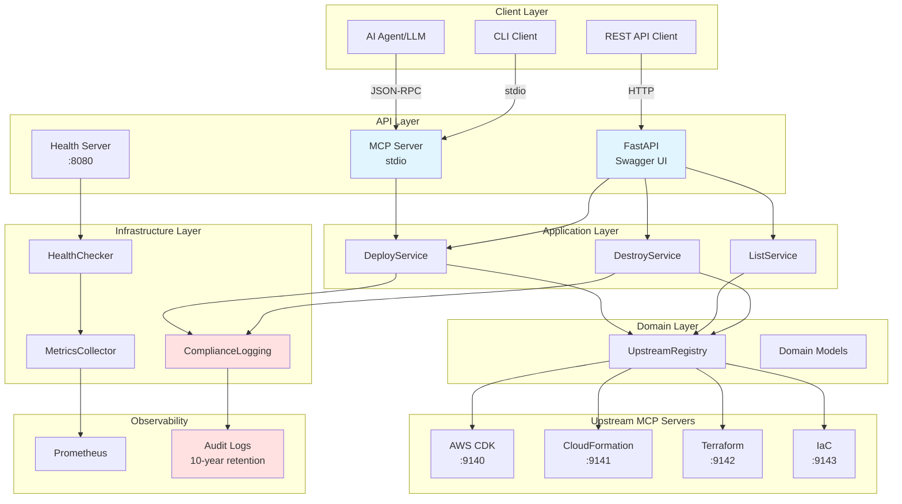
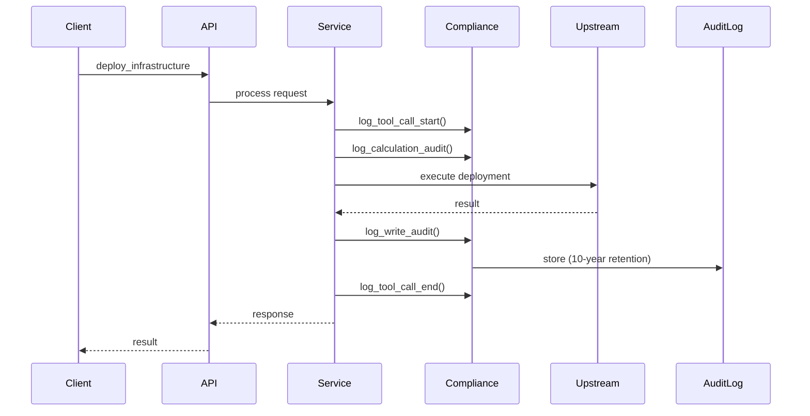
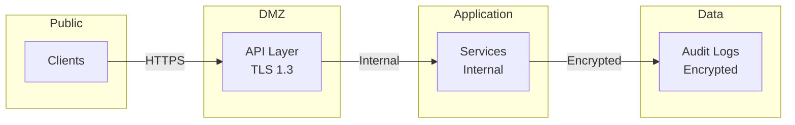

# System Overview Diagram

## High-Level Architecture



## Component Responsibilities

### Client Layer
- **AI Agent/LLM**: Autonomous infrastructure management
- **CLI Client**: Human operators
- **REST API Client**: External systems integration

### API Layer
- **MCP Server**: Model Context Protocol (stdio)
- **Health Server**: Kubernetes probes
- **FastAPI**: REST API with Swagger UI

### Application Layer
- **DeployService**: Infrastructure deployment orchestration
- **ListService**: Stack listing and discovery
- **DestroyService**: Infrastructure destruction with confirmation

### Domain Layer
- **UpstreamRegistry**: MCP server registry and routing
- **Domain Models**: Business logic and validation

### Infrastructure Layer
- **HealthChecker**: Liveness and readiness probes
- **MetricsCollector**: Prometheus metrics
- **ComplianceLogging**: BaFin audit trails

### Upstream Servers
- **AWS CDK**: Cloud Development Kit
- **CloudFormation**: AWS native IaC
- **Terraform**: Multi-cloud IaC
- **IaC**: Generic infrastructure as code

## Data Flow

### Deploy Infrastructure
```
Client → API Layer → DeployService → ComplianceLogging (calculation_audit)
                                   → UpstreamRegistry → Upstream MCP Server
                                   → ComplianceLogging (write_audit)
                                   → MetricsCollector
                                   → Response
```

### Destroy Infrastructure
```
Client → API Layer → DestroyService → Validation (confirmation)
                                    → ComplianceLogging (calculation_audit)
                                    → UpstreamRegistry → Upstream MCP Server
                                    → ComplianceLogging (write_audit)
                                    → MetricsCollector
                                    → Response
```

## Compliance Flow



## Technology Stack

| Layer | Technology | Purpose |
|-------|-----------|---------|
| API | FastAPI | REST API with Swagger |
| API | FastMCP | MCP protocol server |
| Application | Python 3.13 | Service layer |
| Domain | Pydantic | Data validation |
| Infrastructure | Prometheus | Metrics collection |
| Infrastructure | Loguru | Structured logging |
| Deployment | Docker | Containerization |
| Deployment | Kubernetes | Orchestration |
| Deployment | Helm | Package management |

## Network Ports

| Port | Protocol | Purpose |
|------|----------|---------|
| 8080 | HTTP | Health checks, metrics, REST API |
| stdin/stdout | stdio | MCP protocol |
| 9140 | stdio | AWS CDK upstream |
| 9141 | stdio | CloudFormation upstream |
| 9142 | stdio | Terraform upstream |
| 9143 | stdio | IaC upstream |

## Security Boundaries



## Deployment Architecture

See [deployment.md](deployment.md) for detailed deployment architecture.
