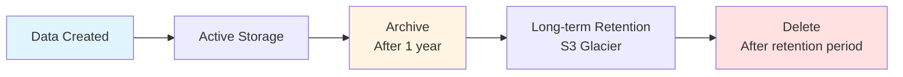

# Data Retention Policy

**Version**: 1.0
**Effective Date**: 2026-03-07
**Review Date**: 2027-03-07
**Owner**: Compliance Team

## Purpose

This policy defines data retention requirements for the Virons Infrastructure MCP Server to comply with BaFin MaRisk AT 8.1, GDPR, and DORA regulations.

## Scope

Applies to all data generated, processed, and stored by the Virons Infrastructure MCP Server.

## Regulatory Requirements

### BaFin MaRisk AT 8.1
- **Requirement**: Audit trails must be retained for 10 years
- **Applies to**: All write operations, calculations, and decisions
- **Format**: Immutable, tamper-proof logs

### GDPR Art 5(1)(e)
- **Requirement**: Data minimization and storage limitation
- **Applies to**: Personal data (if any)
- **Format**: Encrypted, access-controlled

### DORA Art 11
- **Requirement**: ICT-related incident logs for 5 years
- **Applies to**: System logs, errors, incidents
- **Format**: Structured, searchable

## Retention Periods

| Data Type | Retention Period | Regulation | Storage |
|-----------|------------------|------------|---------|
| **Audit Logs** | 10 years | BaFin MaRisk AT 8.1 | Immutable RDS/S3 |
| **Calculation Audit** | 10 years | BaFin MaRisk AT 8.1 | Immutable RDS/S3 |
| **Write Audit** | 10 years | BaFin MaRisk AT 8.1 | Immutable RDS/S3 |
| **Tool Call Logs** | 10 years | BaFin MaRisk AT 8.1 | Immutable RDS/S3 |
| **System Logs** | 5 years | DORA Art 11 | CloudWatch/S3 |
| **Metrics** | 90 days | Operational | Prometheus |
| **Health Checks** | 30 days | Operational | CloudWatch |
| **Temporary Data** | Session only | N/A | Memory |

## Implementation

### Audit Logs (10-year retention)

**Storage**: PostgreSQL RDS with S3 backup

```sql
CREATE TABLE audit_logs (
    id BIGSERIAL PRIMARY KEY,
    correlation_id VARCHAR(64) NOT NULL,
    event_type VARCHAR(50) NOT NULL,
    timestamp TIMESTAMPTZ NOT NULL DEFAULT NOW(),
    user_id VARCHAR(100),
    operation VARCHAR(100),
    entity_type VARCHAR(50),
    entity_id VARCHAR(200),
    changes JSONB,
    compliance VARCHAR(50),
    immutable BOOLEAN DEFAULT true,
    retention_years INTEGER DEFAULT 10,
    created_at TIMESTAMPTZ NOT NULL DEFAULT NOW()
);

-- Prevent updates and deletes
CREATE RULE audit_logs_no_update AS ON UPDATE TO audit_logs DO INSTEAD NOTHING;
CREATE RULE audit_logs_no_delete AS ON DELETE TO audit_logs DO INSTEAD NOTHING;
```

**Backup**: Daily to S3 with versioning enabled

```yaml
backup:
  schedule: "0 2 * * *"  # Daily at 2 AM
  destination: s3://virons-audit-logs/
  retention: 10 years
  encryption: AES-256
  versioning: enabled
```

### System Logs (5-year retention)

**Storage**: CloudWatch Logs with S3 export

```yaml
log_groups:
  - name: /aws/virons/infrastructure-mcp-server
    retention_days: 1825  # 5 years
    export_to_s3: true
    s3_bucket: virons-system-logs
    encryption: KMS
```

### Metrics (90-day retention)

**Storage**: Prometheus with remote write to S3

```yaml
prometheus:
  retention: 90d
  remote_write:
    - url: https://prometheus-remote-write.virons.ai
      queue_config:
        capacity: 10000
        max_shards: 10
```

## Data Lifecycle



## Access Controls

### Audit Logs
- **Read**: Compliance team, auditors
- **Write**: System only (automated)
- **Delete**: Prohibited (immutable)
- **Export**: Compliance team with approval

### System Logs
- **Read**: Operations team, developers
- **Write**: System only
- **Delete**: Automated after retention period
- **Export**: Operations team

## Compliance Verification

### Monthly
- Verify backup completion
- Check storage capacity
- Review access logs

### Quarterly
- Audit retention compliance
- Test restore procedures
- Review access controls

### Annually
- Full compliance audit
- Policy review and update
- Disaster recovery test

## Data Deletion

### Automated Deletion
- System logs: After 5 years
- Metrics: After 90 days
- Temporary data: After session

### Manual Deletion
- Audit logs: **PROHIBITED** (10-year immutable)
- Exception: Legal requirement with documented approval

### Right to Erasure (GDPR Art 17)
- Audit logs: Exempt (legal obligation)
- Personal data: Pseudonymize instead of delete
- Document all erasure requests

## Monitoring

### Alerts
- Backup failure
- Storage capacity >80%
- Unauthorized access attempts
- Retention policy violations

### Dashboards
- Storage usage by data type
- Retention compliance status
- Backup success rate
- Access audit trail

## Exceptions

Exceptions to this policy require:
1. Written justification
2. Compliance team approval
3. Legal review (if applicable)
4. Documentation in exception log

## Review and Updates

- **Review Frequency**: Annually
- **Update Trigger**: Regulatory changes
- **Approval**: Compliance team + Legal
- **Communication**: All stakeholders

## References

- BaFin MaRisk AT 8.1 - Audit Trail Requirements
- GDPR Art 5(1)(e) - Storage Limitation
- DORA Art 11 - ICT Risk Management
- Internal Policy: Data Classification Policy
- Internal Policy: Access Control Policy

## Contact

- **Policy Owner**: compliance@virons.ai
- **Questions**: compliance@virons.ai
- **Incidents**: security@virons.ai

---

**Approved by**: Compliance Team
**Date**: 2026-03-07
**Next Review**: 2027-03-07
