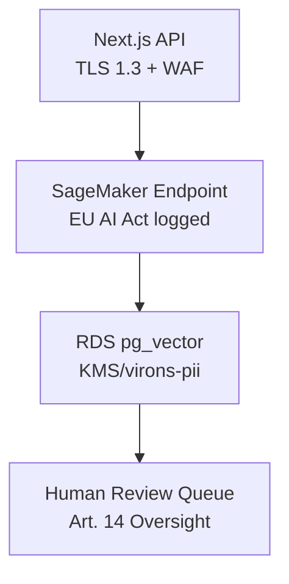

<link rel="stylesheet" href="../platform-resources/styles/virons-markdown.css">
<button onclick="const t=document.body.classList.toggle('theme-light');localStorage.setItem('theme',t?'light':'dark')" style="position:fixed;top:1rem;right:1rem;padding:0.5rem 1rem;border-radius:6px;border:1px solid var(--color-border);background:var(--color-code-bg);color:var(--color-text);cursor:pointer;z-index:1000;">Toggle Theme</button>
<script>if(localStorage.getItem('theme')==='light')document.body.classList.add('theme-light')</script>

# Virons [Service Name]

## Overview

***

Empowers enterprise financial teams with AI-driven forensics and risk analysis. **High-Risk AI System** (EU AI Act Annex III §5b)—BaFin/DORA compliant w/ immutable audit logs (7yr retention).

**Production-ready module for scalable AI inference/compliance.** Deployed in eu-central-1 (Hamburg)—encrypted PII, human oversight.

| Category | Description |
|----------|-------------|
| **Audience** | Fintech compliance officers, risk analysts (enterprise) |
| **Purpose** | Transparent AI forensics w/ EU AI Act traceability |
| **Domain** | `virons.ai/[service]` |
| **Context** | High-risk financial AI (credit/risk mgmt) |
| **Status** | **Production** (CE marked Q2 2026) |
| **Provider** | Virons AI GmbH (DE) |

**Tech Docs**: [docs/COMPLIANCE/technical-docs-v1.pdf](docs/COMPLIANCE/technical-docs-v1.pdf) [web:137]

## Architecture

***

**Serverless inference pipeline**: Next.js API → SageMaker (EU) → PostgreSQL (RDS encrypted). Human-in-loop via PagerDuty escalation.

**Diagram**:

***



## Contents

***

```
service/
├── src/                    # Core inference
│   ├── models/             # Model cards + hashes
│   └── api/                # Endpoints (logged)
├── docs/COMPLIANCE/        # EU AI Act Art. 11
│   ├── technical-docs-v1.pdf
│   ├── fria-v1.pdf         # Fundamental Rights Impact
│   └── ropa.md             # GDPR RoPA
├── logs/                   # Audit trail (immutable)
└── tests/                  # Bias/accuracy
```

## Key Features

***

- **EU AI Act Traceability**: Full input/output logging (Art. 12), model versioning.
- **BaFin/DORA Resilience**: 99.99% uptime, adversarial testing, incident <4h RTO.
- **GDPR Art. 22**: Human override (escalation <5min), DPIA approved.
- **Bias Mitigation**: Dataset FRIA, accuracy >95% (logged).

## Usage

***

```bash
# Deploy (eu-central-1)
cdk deploy Virons-[Service]-Stack --region eu-central-1

# Inference (logged)
curl -H "x-api-key: $VIRONS_KEY" \
     https://[service].virons.ai/api/scan \
     -d '{"data": [...]}' | jq
```

## Dependencies

***

| Dep | Purpose | Compliance |
|-----|---------|------------|
| SageMaker | Inference | EU-hosted, encrypted[web:86] |
| RDS pg | Audit logs | KMS + backups (7yr)[web:130] |
| PagerDuty | Oversight | <5min escalation |

## Testing

***

```bash
# Unit + Bias
go test -v ./... -timeout 5m
pytest tests/bias/ --drift-threshold 0.05

# Resilience (DORA)
chaos-mesh run dora-test.yaml  # Weekly
```

## Metrics & Monitoring

***

- **CloudWatch**: `/aws/virons/[service]` (90d) — LCP<2.5s, error<0.1%.
- **Audit Logs**: Separate group `/aws/virons/audit/[service]` — **7-year immutable** (BaFin/DORA).
- **Alarms**: PagerDuty → Compliance team (Art. 14 oversight).
- **EU AI Act**: Accuracy/drift dashboards (Art. 15).

## Security & Compliance

***

| Regulation | Requirement | Implementation | Evidence |
|------------|-------------|----------------|----------|
| **EU AI Act Art. 9** | Risk mgmt | FRIA + testing | [fria-v1.pdf](docs/COMPLIANCE/fria-v1.pdf) |
| **Art. 11** | Tech docs | Annex IV template | [technical-docs-v1.pdf](docs/COMPLIANCE/technical-docs-v1.pdf) |
| **Art. 12** | Logging | Immutable RDS | `/aws/virons/audit` |
| **Art. 14** | Oversight | PagerDuty queue | [oncall.virons.ai](oncall.virons.ai) |
| **GDPR Art. 22** | Human review | Escalation SLA | DPIA §4.2 |
| **Art. 32** | Encryption | KMS/virons-pii + TLS 1.3 | AWS IAM audit |
| **BaFin MaRisk AT 8.1** | Audit trail | pg_calc_audit table | [logs/audit-schema.sql](logs/) |
| **DORA Art. 6** | ICT framework | Annual pen-test | [ict-policy.pdf](docs/COMPLIANCE/) |

**CE Marked**: Q2 2026 (Notified Body: TÜV). Provider: Virons AI GmbH (Hamburg).

## Navigation
← [virons-ai README](..)

***

**Last Updated**: 2026-03-03

**Maintained By**: compliance@virons.ai

**On-Call**: [PagerDuty](https://virons-ai.pd.virons.ai)

**Audit Repo**: [compliance.virons.ai](compliance.virons.ai)
