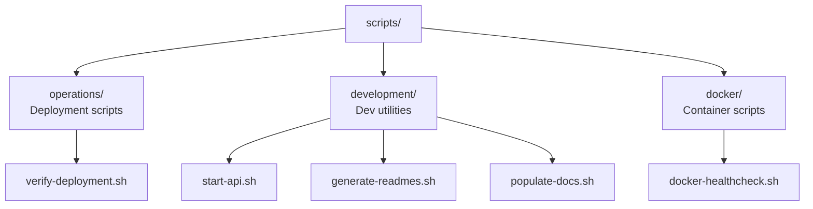

<link rel="stylesheet" href="../platform-resources/styles/virons-markdown.css">
<button onclick="const t=document.body.classList.toggle('theme-light');localStorage.setItem('theme',t?'light':'dark')" style="position:fixed;top:1rem;right:1rem;padding:0.5rem 1rem;border-radius:6px;border:1px solid var(--color-border);background:var(--color-code-bg);color:var(--color-text);cursor:pointer;z-index:1000;">Toggle Theme</button>
<script>if(localStorage.getItem('theme')==='light')document.body.classList.add('theme-light')</script>

# Virons Infrastructure MCP Server - Scripts

## Overview

***

Utility scripts for operations, development, and Docker. **Production-ready automation** — deployment verification, API startup, health checks.

**Organized by purpose.** Operations, development, Docker utilities.

| Category | Description |
|----------|-------------|
| **Audience** | DevOps engineers, developers |
| **Purpose** | Automation scripts for deployment and development |
| **Domain** | `scripts` |
| **Context** | Automation utilities |
| **Status** | **Production** |
| **Provider** | Virons AI GmbH (DE) |

**Tech Docs**: [docs/](../docs/)

## Architecture

***

**Script organization**: Categorized by purpose (operations/development/docker).

**Diagram**:

***



## Contents

***

```
scripts/
├── operations/             # Deployment and operations
│   └── verify-deployment.sh
├── development/            # Development utilities
│   ├── start-api.sh
│   ├── generate-readmes.sh
│   └── populate-docs.sh
└── docker/                 # Docker utilities
    └── docker-healthcheck.sh
```

## Key Features

***

- **Operations**: Deployment verification, health checks
- **Development**: API startup, documentation generation
- **Docker**: Container health checks
- **Executable**: All scripts have execute permissions

## Usage

***

```bash
# Operations - Verify Kubernetes deployment
./scripts/operations/verify-deployment.sh

# Development - Start API server with Swagger UI
./scripts/development/start-api.sh

# Development - Generate README files
./scripts/development/generate-readmes.sh

# Development - Populate documentation
./scripts/development/populate-docs.sh

# Docker - Health check (used in Dockerfile)
./scripts/docker/docker-healthcheck.sh
```

## Dependencies

***

| Dep | Purpose | Compliance |
|-----|---------|------------|
| bash | Shell scripting | Standard |
| kubectl | K8s operations | Operations |
| curl | HTTP checks | Health checks |

## Testing

***

```bash
# Test operations scripts
./scripts/operations/verify-deployment.sh

# Test development scripts
./scripts/development/start-api.sh

# Test Docker scripts
./scripts/docker/docker-healthcheck.sh
```

## Metrics & Monitoring

***

- **Script Execution**: Logged via stdout/stderr
- **Exit Codes**: 0 = success, non-zero = failure
- **Health Checks**: Docker healthcheck reports to container runtime

## Security & Compliance

***

| Regulation | Requirement | Implementation | Evidence |
|------------|-------------|----------------|----------|
| **DORA Art. 11** | Deployment verification | verify-deployment.sh | [docs/operations/deployment/complete.md](../docs/operations/deployment/complete.md) |
| **BaFin MaRisk AT 8.1** | Audit trail | Script execution logged | [docs/compliance/evidence/bafin-compliance.md](../docs/compliance/evidence/bafin-compliance.md) |

## Navigation
← [Package Root](../)

***

**Last Updated**: 2026-03-07

**Maintained By**: platform@virons.ai

**Documentation**: [docs/](../docs/)
