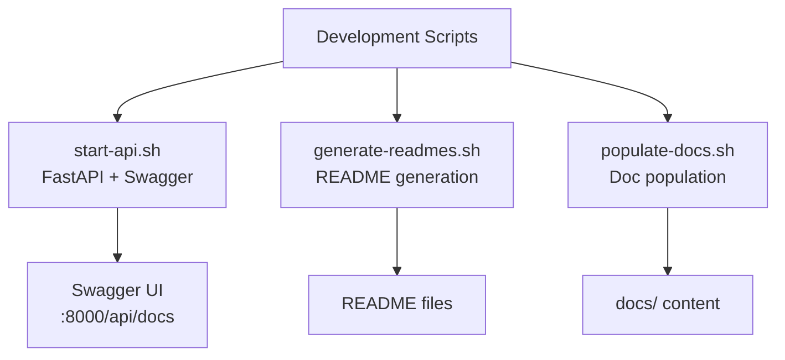

<link rel="stylesheet" href="../../platform-resources/styles/virons-markdown.css">
<button onclick="const t=document.body.classList.toggle('theme-light');localStorage.setItem('theme',t?'light':'dark')" style="position:fixed;top:1rem;right:1rem;padding:0.5rem 1rem;border-radius:6px;border:1px solid var(--color-border);background:var(--color-code-bg);color:var(--color-text);cursor:pointer;z-index:1000;">Toggle Theme</button>
<script>if(localStorage.getItem('theme')==='light')document.body.classList.add('theme-light')</script>

# Virons Infrastructure MCP Server - Development Scripts

## Overview

***

Development automation for API startup and documentation generation. **Developer productivity** — fast iteration, automated docs.

**Development utilities.** API server, README generation, documentation population.

| Category | Description |
|----------|-------------|
| **Audience** | Developers, documentation writers |
| **Purpose** | Development automation and documentation |
| **Domain** | `scripts/development` |
| **Context** | Development automation |
| **Status** | **Production** |
| **Provider** | Virons AI GmbH (DE) |

**Tech Docs**: [docs/development/](../../docs/development/)

## Architecture

***

**Development workflow**: Start API → Generate docs → Populate content.

**Diagram**:

***



## Contents

***

```
development/
├── start-api.sh            # Start FastAPI server
├── generate-readmes.sh     # Generate README files
└── populate-docs.sh        # Populate documentation
```

## Key Features

***

- **API Startup**: Launch FastAPI with Swagger UI
- **README Generation**: Auto-generate README files
- **Doc Population**: Populate documentation structure
- **Fast Iteration**: Quick development cycle

## Usage

***

```bash
# Start API server with Swagger UI
./scripts/development/start-api.sh
# Access: http://localhost:8000/api/docs

# Generate README files
./scripts/development/generate-readmes.sh

# Populate documentation
./scripts/development/populate-docs.sh
```

## Dependencies

***

| Dep | Purpose | Compliance |
|-----|---------|------------|
| python | API server | Required |
| bash | Shell scripting | Standard |

## Testing

***

```bash
# Test API startup
./scripts/development/start-api.sh
curl http://localhost:8000/health

# Test README generation
./scripts/development/generate-readmes.sh
ls -la virons/infrastructure_mcp_server/*/README.md

# Test doc population
./scripts/development/populate-docs.sh
ls -la docs/
```

## Metrics & Monitoring

***

- **API Server**: Logs to stdout
- **Script Execution**: Exit codes (0 = success)
- **Documentation**: File creation logs

## Security & Compliance

***

| Regulation | Requirement | Implementation | Evidence |
|------------|-------------|----------------|----------|
| **Development Standards** | Code quality | Automated tooling | [docs/development/contributing/code-style.md](../../docs/development/contributing/code-style.md) |
| **Documentation** | Complete docs | Auto-generation | [docs/CHECKLIST.md](../../docs/CHECKLIST.md) |

## Navigation
← [scripts README](../)

***

**Last Updated**: 2026-03-07

**Maintained By**: platform@virons.ai

**Dev Guides**: [docs/development/](../../docs/development/)
