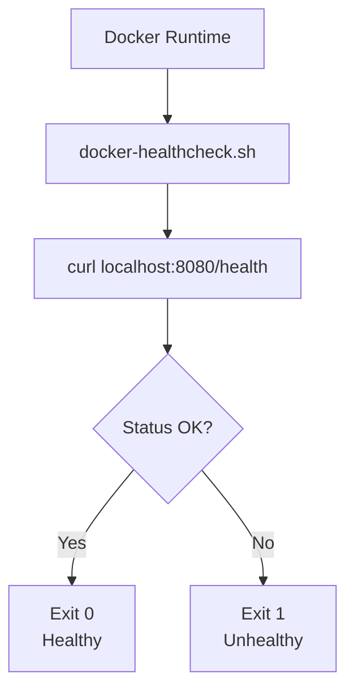

<link rel="stylesheet" href="../../platform-resources/styles/virons-markdown.css">
<button onclick="const t=document.body.classList.toggle('theme-light');localStorage.setItem('theme',t?'light':'dark')" style="position:fixed;top:1rem;right:1rem;padding:0.5rem 1rem;border-radius:6px;border:1px solid var(--color-border);background:var(--color-code-bg);color:var(--color-text);cursor:pointer;z-index:1000;">Toggle Theme</button>
<script>if(localStorage.getItem('theme')==='light')document.body.classList.add('theme-light')</script>

# Virons Infrastructure MCP Server - Docker Scripts

## Overview

***

Docker container utilities for health checks. **Production-ready** — container health monitoring.

**Container health checks.** Used by Docker HEALTHCHECK directive.

| Category | Description |
|----------|-------------|
| **Audience** | DevOps engineers, container platform teams |
| **Purpose** | Docker container health monitoring |
| **Domain** | `scripts/docker` |
| **Context** | Container automation |
| **Status** | **Production** |
| **Provider** | Virons AI GmbH (DE) |

**Tech Docs**: [docs/operations/](../../docs/operations/)

## Architecture

***

**Health check workflow**: Curl health endpoint → Check status → Return exit code.

**Diagram**:

***



## Contents

***

```
docker/
└── docker-healthcheck.sh   # Container health check
```

## Key Features

***

- **Health Endpoint**: Check /health endpoint
- **Exit Codes**: 0 = healthy, 1 = unhealthy
- **Docker Integration**: Used in Dockerfile HEALTHCHECK
- **Lightweight**: Minimal dependencies (curl)

## Usage

***

```bash
# Manual health check
./scripts/docker/docker-healthcheck.sh

# Used in Dockerfile
HEALTHCHECK --interval=30s --timeout=3s --start-period=5s --retries=3 \
  CMD ["/app/scripts/docker/docker-healthcheck.sh"]

# Check container health
docker ps  # Shows health status
docker inspect <container> | jq '.[0].State.Health'
```

## Dependencies

***

| Dep | Purpose | Compliance |
|-----|---------|------------|
| curl | HTTP checks | Required |
| bash | Shell scripting | Standard |

## Testing

***

```bash
# Test health check script
./scripts/docker/docker-healthcheck.sh
echo $?  # Should be 0 if healthy

# Test in Docker
docker build -t virons-infra-mcp .
docker run -d --name test virons-infra-mcp
sleep 10
docker ps  # Check health status
```

## Metrics & Monitoring

***

- **Exit Codes**: 0 = healthy, 1 = unhealthy
- **Docker Health**: Reported to container runtime
- **Kubernetes**: Used for liveness/readiness probes

## Security & Compliance

***

| Regulation | Requirement | Implementation | Evidence |
|------------|-------------|----------------|----------|
| **DORA Art. 11** | Health monitoring | docker-healthcheck.sh | [docs/operations/deployment/complete.md](../../docs/operations/deployment/complete.md) |
| **Container Security** | Health checks | HEALTHCHECK directive | [Dockerfile](../../Dockerfile) |

## Navigation
← [scripts README](../)

***

**Last Updated**: 2026-03-07

**Maintained By**: platform@virons.ai

**Dockerfile**: [Dockerfile](../../Dockerfile)
