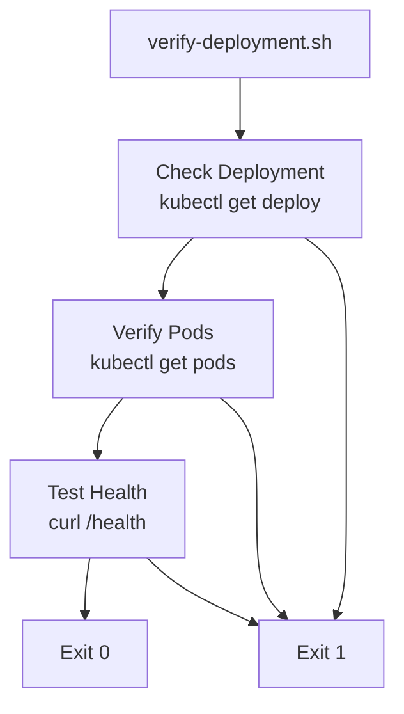

<link rel="stylesheet" href="../../platform-resources/styles/virons-markdown.css">
<button onclick="const t=document.body.classList.toggle('theme-light');localStorage.setItem('theme',t?'light':'dark')" style="position:fixed;top:1rem;right:1rem;padding:0.5rem 1rem;border-radius:6px;border:1px solid var(--color-border);background:var(--color-code-bg);color:var(--color-text);cursor:pointer;z-index:1000;">Toggle Theme</button>
<script>if(localStorage.getItem('theme')==='light')document.body.classList.add('theme-light')</script>

# Virons Infrastructure MCP Server - Operations Scripts

## Overview

***

Operations automation for deployment verification. **Production-ready** — Kubernetes health checks, pod status verification.

**Deployment verification scripts.** Ensure successful K8s deployments.

| Category | Description |
|----------|-------------|
| **Audience** | DevOps engineers, SRE teams |
| **Purpose** | Verify production deployments |
| **Domain** | `scripts/operations` |
| **Context** | Operations automation |
| **Status** | **Production** |
| **Provider** | Virons AI GmbH (DE) |

**Tech Docs**: [docs/operations/](../../docs/operations/)

## Architecture

***

**Verification workflow**: Check deployment → Verify pods → Test health endpoints.

**Diagram**:

***



## Contents

***

```
operations/
└── verify-deployment.sh    # Kubernetes deployment verification
```

## Key Features

***

- **Deployment Check**: Verify K8s deployment exists
- **Pod Status**: Check all pods are running
- **Health Endpoint**: Test /health endpoint
- **Exit Codes**: 0 = success, 1 = failure

## Usage

***

```bash
# Verify deployment in current namespace
./scripts/operations/verify-deployment.sh

# Verify specific deployment
DEPLOYMENT_NAME=virons-infra-mcp ./scripts/operations/verify-deployment.sh

# Verify in specific namespace
NAMESPACE=virons-platform ./scripts/operations/verify-deployment.sh
```

## Dependencies

***

| Dep | Purpose | Compliance |
|-----|---------|------------|
| kubectl | K8s operations | Required |
| curl | HTTP checks | Required |
| bash | Shell scripting | Standard |

## Testing

***

```bash
# Test verification script
./scripts/operations/verify-deployment.sh

# Expected output:
# ✓ Deployment found
# ✓ All pods running
# ✓ Health check passed
```

## Metrics & Monitoring

***

- **Exit Codes**: 0 = success, non-zero = failure
- **Stdout**: Progress messages
- **Stderr**: Error messages

## Security & Compliance

***

| Regulation | Requirement | Implementation | Evidence |
|------------|-------------|----------------|----------|
| **DORA Art. 11** | Deployment verification | verify-deployment.sh | [docs/operations/deployment/complete.md](../../docs/operations/deployment/complete.md) |
| **BaFin MaRisk AT 8.1** | Audit trail | Script execution logged | [docs/compliance/evidence/bafin-compliance.md](../../docs/compliance/evidence/bafin-compliance.md) |

## Navigation
← [scripts README](../)

***

**Last Updated**: 2026-03-07

**Maintained By**: platform@virons.ai

**Runbooks**: [docs/operations/runbooks/](../../docs/operations/runbooks/)
