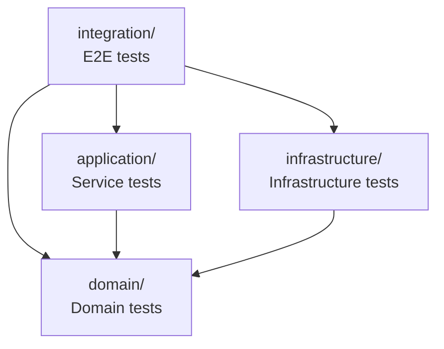

<link rel="stylesheet" href="../platform-resources/styles/virons-markdown.css">
<button onclick="const t=document.body.classList.toggle('theme-light');localStorage.setItem('theme',t?'light':'dark')" style="position:fixed;top:1rem;right:1rem;padding:0.5rem 1rem;border-radius:6px;border:1px solid var(--color-border);background:var(--color-code-bg);color:var(--color-text);cursor:pointer;z-index:1000;">Toggle Theme</button>
<script>if(localStorage.getItem('theme')==='light')document.body.classList.add('theme-light')</script>

# Virons Infrastructure MCP Server - Test Suite

## Overview

***

Comprehensive test suite with 88% coverage. **TDD approach** — unit, integration, E2E tests.

**Production-quality testing.** Pytest, mocking, async tests, compliance verification.

| Category | Description |
|----------|-------------|
| **Audience** | Developers, QA engineers |
| **Purpose** | Verify functionality and compliance |
| **Domain** | `tests` |
| **Context** | Test-Driven Development (TDD) |
| **Status** | **Production** |
| **Provider** | Virons AI GmbH (DE) |

**Tech Docs**: [docs/development/testing/](../docs/development/testing/)

## Architecture

***

**Layered testing**: Unit tests per layer, integration tests for workflows, E2E for full scenarios.

**Diagram**:

***



## Contents

***

```
tests/
├── domain/                 # Domain layer tests
│   ├── test_mcp_client.py
│   ├── test_upstream_registry.py
│   └── test_models.py
├── application/            # Application layer tests
│   ├── test_deploy_service.py
│   └── test_list_destroy_services.py
├── infrastructure/         # Infrastructure layer tests
│   ├── test_health.py
│   ├── test_health_server.py
│   ├── test_metrics.py
│   ├── test_helm_chart.py
│   └── test_dockerfile.py
├── integration/            # Integration tests
│   └── test_end_to_end.py
├── test_server.py          # Server tests
├── test_compliance.py      # Compliance tests
└── test_init.py            # Package tests
```

## Key Features

***

- **88% Coverage**: Comprehensive test coverage
- **Async Tests**: pytest-asyncio for async code
- **Mocking**: pytest-mock for dependencies
- **Integration Tests**: Full workflow testing
- **Compliance Tests**: Audit logging verification

## Usage

***

```bash
# Run all tests
pytest tests/ -v

# Run with coverage
pytest tests/ --cov=virons.infrastructure_mcp_server --cov-report=html

# Run specific layer
pytest tests/domain/ -v
pytest tests/application/ -v
pytest tests/infrastructure/ -v

# Run integration tests
pytest tests/integration/ -v

# Run with markers
pytest -m "not slow" -v
```

## Dependencies

***

| Dep | Purpose | Compliance |
|-----|---------|------------|
| pytest | Test framework | Industry standard |
| pytest-asyncio | Async tests | Async support |
| pytest-mock | Mocking | Test isolation |
| pytest-cov | Coverage | Quality metrics |

## Testing

***

```bash
# Quick test
pytest tests/ -x  # Stop on first failure

# Verbose output
pytest tests/ -vv

# Show print statements
pytest tests/ -s

# Coverage report
pytest tests/ --cov --cov-report=term-missing
```

## Metrics & Monitoring

***

- **Test Coverage**: 88% (target: 90%+)
- **Test Count**: 50+ tests
- **Test Duration**: ~30 seconds
- **CI/CD**: Automated on every PR

## Security & Compliance

***

| Regulation | Requirement | Implementation | Evidence |
|------------|-------------|----------------|----------|
| **BaFin MaRisk AT 8.1** | Audit verification | test_compliance.py | [docs/development/testing/unit-tests.md](../docs/development/testing/unit-tests.md) |
| **DORA Art. 11** | Testing procedures | Integration tests | [docs/development/testing/integration-tests.md](../docs/development/testing/integration-tests.md) |

## Navigation
← [Package Root](../)

***

**Last Updated**: 2026-03-07

**Maintained By**: platform@virons.ai

**Test Guides**: [docs/development/testing/](../docs/development/testing/)
