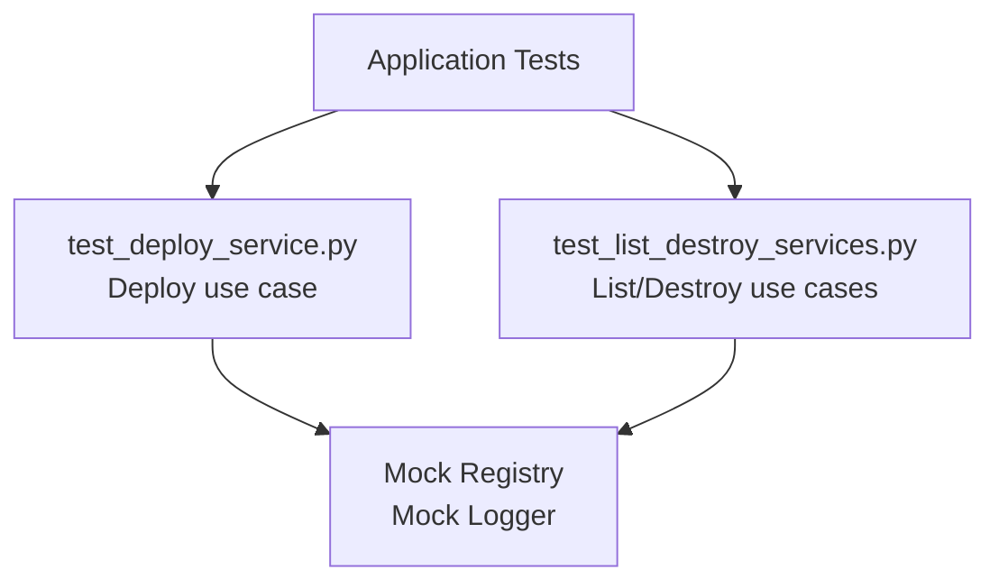

<link rel="stylesheet" href="../../platform-resources/styles/virons-markdown.css">
<button onclick="const t=document.body.classList.toggle('theme-light');localStorage.setItem('theme',t?'light':'dark')" style="position:fixed;top:1rem;right:1rem;padding:0.5rem 1rem;border-radius:6px;border:1px solid var(--color-border);background:var(--color-code-bg);color:var(--color-text);cursor:pointer;z-index:1000;">Toggle Theme</button>
<script>if(localStorage.getItem('theme')==='light')document.body.classList.add('theme-light')</script>

# Virons Infrastructure MCP Server - Application Tests

## Overview

***

Unit tests for application layer. **Service testing** — mocked dependencies, use case verification.

**Application layer test suite.** Deploy, destroy, list services.

| Category | Description |
|----------|-------------|
| **Audience** | Developers, QA engineers |
| **Purpose** | Verify use case orchestration |
| **Domain** | `tests/application` |
| **Context** | Unit testing (DDD) |
| **Status** | **Production** |
| **Provider** | Virons AI GmbH (DE) |

**Tech Docs**: [docs/development/testing/unit-tests.md](../../docs/development/testing/unit-tests.md)

## Architecture

***

**Service tests**: Mock dependencies, verify orchestration logic.

**Diagram**:

***



## Contents

***

```
application/
├── test_deploy_service.py          # Deploy service tests
└── test_list_destroy_services.py   # List/destroy service tests
```

## Key Features

***

- **Mocked Dependencies**: Isolated service testing
- **Compliance Verification**: Audit logging checks
- **Async Tests**: pytest-asyncio support
- **High Coverage**: 90%+ application coverage

## Usage

***

```bash
# Run application tests
pytest tests/application/ -v

# Run with coverage
pytest tests/application/ --cov=virons.infrastructure_mcp_server.application

# Run specific test
pytest tests/application/test_deploy_service.py -v
```

## Dependencies

***

| Dep | Purpose | Compliance |
|-----|---------|------------|
| pytest | Test framework | Standard |
| pytest-asyncio | Async tests | Required |
| pytest-mock | Mocking | Required |

## Testing

***

```bash
# Quick test
pytest tests/application/ -x

# Verbose
pytest tests/application/ -vv

# Coverage report
pytest tests/application/ --cov --cov-report=term-missing
```

## Metrics & Monitoring

***

- **Test Count**: 10+ tests
- **Coverage**: 90%+
- **Duration**: ~2 seconds
- **Async Tests**: Full async support

## Security & Compliance

***

| Regulation | Requirement | Implementation | Evidence |
|------------|-------------|----------------|----------|
| **BaFin MaRisk AT 8.1** | Audit verification | Compliance logging tests | [docs/development/testing/unit-tests.md](../../docs/development/testing/unit-tests.md) |

## Navigation
← [tests README](../)

***

**Last Updated**: 2026-03-07

**Maintained By**: platform@virons.ai
