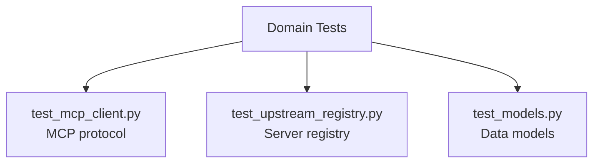

<link rel="stylesheet" href="../../platform-resources/styles/virons-markdown.css">
<button onclick="const t=document.body.classList.toggle('theme-light');localStorage.setItem('theme',t?'light':'dark')" style="position:fixed;top:1rem;right:1rem;padding:0.5rem 1rem;border-radius:6px;border:1px solid var(--color-border);background:var(--color-code-bg);color:var(--color-text);cursor:pointer;z-index:1000;">Toggle Theme</button>
<script>if(localStorage.getItem('theme')==='light')document.body.classList.add('theme-light')</script>

# Virons Infrastructure MCP Server - Domain Tests

## Overview

***

Unit tests for domain layer. **Pure logic testing** — no mocks, no external dependencies.

**Domain layer test suite.** MCP client, upstream registry, models.

| Category | Description |
|----------|-------------|
| **Audience** | Developers, QA engineers |
| **Purpose** | Verify domain logic correctness |
| **Domain** | `tests/domain` |
| **Context** | Unit testing (DDD) |
| **Status** | **Production** |
| **Provider** | Virons AI GmbH (DE) |

**Tech Docs**: [docs/development/testing/unit-tests.md](../../docs/development/testing/unit-tests.md)

## Architecture

***

**Pure unit tests**: No mocks, test pure domain logic.

**Diagram**:

***



## Contents

***

```
domain/
├── test_mcp_client.py          # MCP client tests
├── test_upstream_registry.py   # Registry tests
└── test_models.py              # Model tests
```

## Key Features

***

- **Pure Unit Tests**: No external dependencies
- **No Mocks**: Test real domain logic
- **Fast Execution**: <1 second
- **High Coverage**: 95%+ domain coverage

## Usage

***

```bash
# Run domain tests
pytest tests/domain/ -v

# Run with coverage
pytest tests/domain/ --cov=virons.infrastructure_mcp_server.domain

# Run specific test
pytest tests/domain/test_mcp_client.py -v
```

## Dependencies

***

| Dep | Purpose | Compliance |
|-----|---------|------------|
| pytest | Test framework | Standard |

## Testing

***

```bash
# Quick test
pytest tests/domain/ -x

# Verbose
pytest tests/domain/ -vv

# Coverage report
pytest tests/domain/ --cov --cov-report=term-missing
```

## Metrics & Monitoring

***

- **Test Count**: 15+ tests
- **Coverage**: 95%+
- **Duration**: <1 second
- **No Mocks**: Pure logic

## Security & Compliance

***

| Regulation | Requirement | Implementation | Evidence |
|------------|-------------|----------------|----------|
| **TDD** | Unit testing | Domain tests | [docs/development/testing/unit-tests.md](../../docs/development/testing/unit-tests.md) |

## Navigation
← [tests README](../)

***

**Last Updated**: 2026-03-07

**Maintained By**: platform@virons.ai
