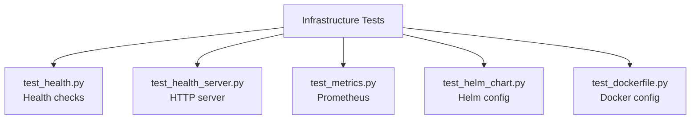

<link rel="stylesheet" href="../../platform-resources/styles/virons-markdown.css">
<button onclick="const t=document.body.classList.toggle('theme-light');localStorage.setItem('theme',t?'light':'dark')" style="position:fixed;top:1rem;right:1rem;padding:0.5rem 1rem;border-radius:6px;border:1px solid var(--color-border);background:var(--color-code-bg);color:var(--color-text);cursor:pointer;z-index:1000;">Toggle Theme</button>
<script>if(localStorage.getItem('theme')==='light')document.body.classList.add('theme-light')</script>

# Virons Infrastructure MCP Server - Infrastructure Tests

## Overview

***

Unit tests for infrastructure layer. **External integration testing** — health, metrics, Docker, Helm.

**Infrastructure layer test suite.** Health checks, metrics, deployment artifacts.

| Category | Description |
|----------|-------------|
| **Audience** | Developers, DevOps engineers |
| **Purpose** | Verify external integrations |
| **Domain** | `tests/infrastructure` |
| **Context** | Unit testing (DDD) |
| **Status** | **Production** |
| **Provider** | Virons AI GmbH (DE) |

**Tech Docs**: [docs/development/testing/unit-tests.md](../../docs/development/testing/unit-tests.md)

## Architecture

***

**Infrastructure tests**: Verify adapters, health checks, metrics, deployment configs.

**Diagram**:

***



## Contents

***

```
infrastructure/
├── test_health.py              # Health check tests
├── test_health_server.py       # Health server tests
├── test_metrics.py             # Metrics tests
├── test_helm_chart.py          # Helm chart tests
└── test_dockerfile.py          # Dockerfile tests
```

## Key Features

***

- **Health Testing**: Verify health endpoints
- **Metrics Testing**: Prometheus metric collection
- **Config Testing**: Helm and Docker validation
- **Integration Points**: External system adapters

## Usage

***

```bash
# Run infrastructure tests
pytest tests/infrastructure/ -v

# Run with coverage
pytest tests/infrastructure/ --cov=virons.infrastructure_mcp_server.infrastructure

# Run specific test
pytest tests/infrastructure/test_health.py -v
```

## Dependencies

***

| Dep | Purpose | Compliance |
|-----|---------|------------|
| pytest | Test framework | Standard |
| pytest-asyncio | Async tests | Required |

## Testing

***

```bash
# Quick test
pytest tests/infrastructure/ -x

# Verbose
pytest tests/infrastructure/ -vv

# Coverage report
pytest tests/infrastructure/ --cov --cov-report=term-missing
```

## Metrics & Monitoring

***

- **Test Count**: 15+ tests
- **Coverage**: 85%+
- **Duration**: ~3 seconds
- **Config Validation**: Helm + Docker

## Security & Compliance

***

| Regulation | Requirement | Implementation | Evidence |
|------------|-------------|----------------|----------|
| **DORA Art. 11** | Monitoring tests | Metrics verification | [docs/development/testing/unit-tests.md](../../docs/development/testing/unit-tests.md) |

## Navigation
← [tests README](../)

***

**Last Updated**: 2026-03-07

**Maintained By**: platform@virons.ai
