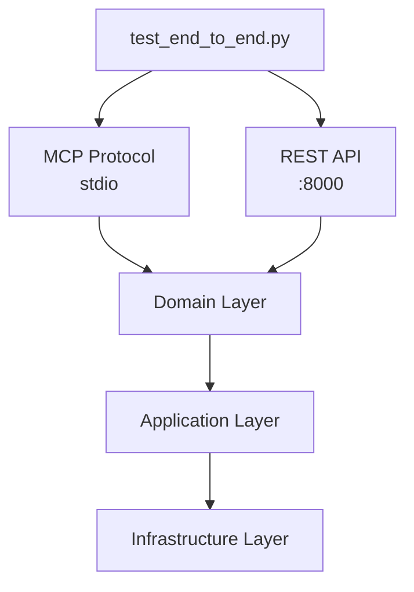

<link rel="stylesheet" href="../../platform-resources/styles/virons-markdown.css">
<button onclick="const t=document.body.classList.toggle('theme-light');localStorage.setItem('theme',t?'light':'dark')" style="position:fixed;top:1rem;right:1rem;padding:0.5rem 1rem;border-radius:6px;border:1px solid var(--color-border);background:var(--color-code-bg);color:var(--color-text);cursor:pointer;z-index:1000;">Toggle Theme</button>
<script>if(localStorage.getItem('theme')==='light')document.body.classList.add('theme-light')</script>

# Virons Infrastructure MCP Server - Integration Tests

## Overview

***

End-to-end integration tests. **Full workflow testing** — MCP protocol, API endpoints, complete scenarios.

**Integration test suite.** E2E workflows, multi-layer integration.

| Category | Description |
|----------|-------------|
| **Audience** | Developers, QA engineers |
| **Purpose** | Verify complete workflows |
| **Domain** | `tests/integration` |
| **Context** | Integration testing |
| **Status** | **Production** |
| **Provider** | Virons AI GmbH (DE) |

**Tech Docs**: [docs/development/testing/integration-tests.md](../../docs/development/testing/integration-tests.md)

## Architecture

***

**E2E testing**: Full stack integration, all layers working together.

**Diagram**:

***



## Contents

***

```
integration/
└── test_end_to_end.py          # E2E workflow tests
```

## Key Features

***

- **Full Stack**: All layers integrated
- **Real Workflows**: Deploy → List → Destroy
- **MCP Protocol**: Complete MCP testing
- **API Testing**: REST endpoint verification

## Usage

***

```bash
# Run integration tests
pytest tests/integration/ -v

# Run with coverage
pytest tests/integration/ --cov=virons.infrastructure_mcp_server

# Run specific test
pytest tests/integration/test_end_to_end.py -v
```

## Dependencies

***

| Dep | Purpose | Compliance |
|-----|---------|------------|
| pytest | Test framework | Standard |
| pytest-asyncio | Async tests | Required |

## Testing

***

```bash
# Quick test
pytest tests/integration/ -x

# Verbose
pytest tests/integration/ -vv

# Slow tests (marked)
pytest tests/integration/ -m "slow" -v
```

## Metrics & Monitoring

***

- **Test Count**: 5+ E2E tests
- **Coverage**: Full stack
- **Duration**: ~10 seconds
- **Real Workflows**: Complete scenarios

## Security & Compliance

***

| Regulation | Requirement | Implementation | Evidence |
|------------|-------------|----------------|----------|
| **DORA Art. 11** | E2E testing | Integration tests | [docs/development/testing/integration-tests.md](../../docs/development/testing/integration-tests.md) |

## Navigation
← [tests README](../)

***

**Last Updated**: 2026-03-07

**Maintained By**: platform@virons.ai
