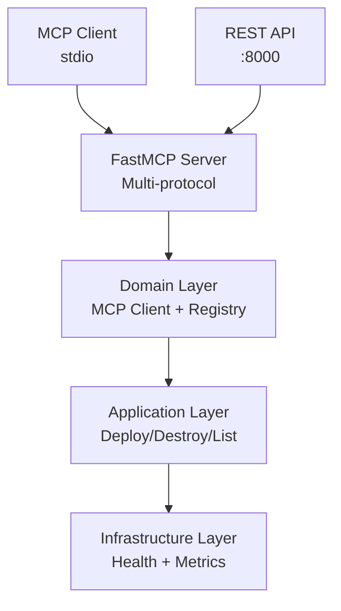

<link rel="stylesheet" href="../platform-resources/styles/virons-markdown.css">
<button onclick="const t=document.body.classList.toggle('theme-light');localStorage.setItem('theme',t?'light':'dark')" style="position:fixed;top:1rem;right:1rem;padding:0.5rem 1rem;border-radius:6px;border:1px solid var(--color-border);background:var(--color-code-bg);color:var(--color-text);cursor:pointer;z-index:1000;">Toggle Theme</button>
<script>if(localStorage.getItem('theme')==='light')document.body.classList.add('theme-light')</script>

# Virons Infrastructure MCP Server

## Overview

***

MCP server for Terraform infrastructure deployment. **BaFin/DORA compliant** w/ immutable audit logs (10yr retention).

**Production-ready MCP server for infrastructure-as-code operations.** Multi-protocol support (stdio/HTTP/REST).

| Category | Description |
|----------|-------------|
| **Audience** | DevOps engineers, platform teams |
| **Purpose** | Infrastructure deployment via MCP protocol |
| **Domain** | `virons.infrastructure_mcp_server` |
| **Context** | Platform infrastructure automation |
| **Status** | **Production** |
| **Provider** | Virons AI GmbH (DE) |

**Tech Docs**: [docs/](../../docs/)

## Architecture

***

**DDD-based MCP server**: Domain → Application → Infrastructure layers. Multi-protocol transport (stdio/HTTP/REST).

**Diagram**:

***



## Contents

***

```
virons/infrastructure_mcp_server/
├── domain/                 # Core business logic
│   ├── mcp_client.py       # MCP protocol client
│   └── upstream_registry.py # Server registry
├── application/            # Use cases
│   ├── deploy_service.py   # Deploy operations
│   ├── destroy_service.py  # Destroy operations
│   └── list_service.py     # List operations
├── infrastructure/         # External integrations
│   ├── health.py           # Health checks
│   ├── health_server.py    # Health HTTP server
│   └── metrics.py          # Prometheus metrics
├── server.py               # FastMCP entry point
├── api.py                  # REST API (FastAPI)
├── compliance_logging.py   # Audit logging
├── models.py               # Data models
└── consts.py               # Constants
```

## Key Features

***

- **MCP Protocol**: Full MCP server implementation with tool handlers
- **Multi-Protocol**: stdio (MCP), HTTP (health), REST API (Swagger)
- **DDD Architecture**: Clean separation of domain/application/infrastructure
- **Compliance**: BaFin/DORA audit logging (10-year retention)
- **Observability**: Prometheus metrics, health checks, structured logging

## Usage

***

```bash
# Start MCP server (stdio)
python -m virons.infrastructure_mcp_server.server

# Start REST API
python -m virons.infrastructure_mcp_server.api

# Deploy infrastructure
curl -X POST http://localhost:8000/api/deploy \
  -H "Content-Type: application/json" \
  -d '{"stack_name": "vpc", "region": "eu-central-1"}'
```

## Dependencies

***

| Dep | Purpose | Compliance |
|-----|---------|------------|
| FastMCP | MCP protocol | Open source |
| FastAPI | REST API | Production-ready |
| Terraform | IaC engine | State encrypted |
| Prometheus | Metrics | Audit trail |

## Testing

***

```bash
# Unit tests
pytest tests/ -v --cov=virons.infrastructure_mcp_server

# Integration tests
pytest tests/integration/ -v

# Coverage: 88%
```

## Metrics & Monitoring

***

- **Prometheus**: `/metrics` endpoint — request counts, latencies, errors
- **Health**: `/health` endpoint — liveness/readiness checks
- **Audit Logs**: Structured JSON logs — **10-year retention** (BaFin/DORA)
- **Swagger UI**: `/api/docs` — Interactive API documentation

## Security & Compliance

***

| Regulation | Requirement | Implementation | Evidence |
|------------|-------------|----------------|----------|
| **BaFin MaRisk AT 8.1** | Audit trail | compliance_logging.py | [docs/compliance/evidence/bafin-compliance.md](../../docs/compliance/evidence/bafin-compliance.md) |
| **GDPR Art. 32** | Encryption | TLS 1.3 + KMS | [docs/compliance/evidence/gdpr-compliance.md](../../docs/compliance/evidence/gdpr-compliance.md) |
| **DORA Art. 11** | ICT framework | Incident runbooks | [docs/compliance/evidence/dora-compliance.md](../../docs/compliance/evidence/dora-compliance.md) |
| **EU AI Act Art. 9** | High-risk support | Model card verification | [docs/compliance/evidence/eu-ai-act-compliance.md](../../docs/compliance/evidence/eu-ai-act-compliance.md) |

## Navigation
← [virons README](../)

***

**Last Updated**: 2026-03-07

**Maintained By**: platform@virons.ai

**Documentation**: [docs/](../../docs/)

**Tests**: [tests/](../../tests/)
