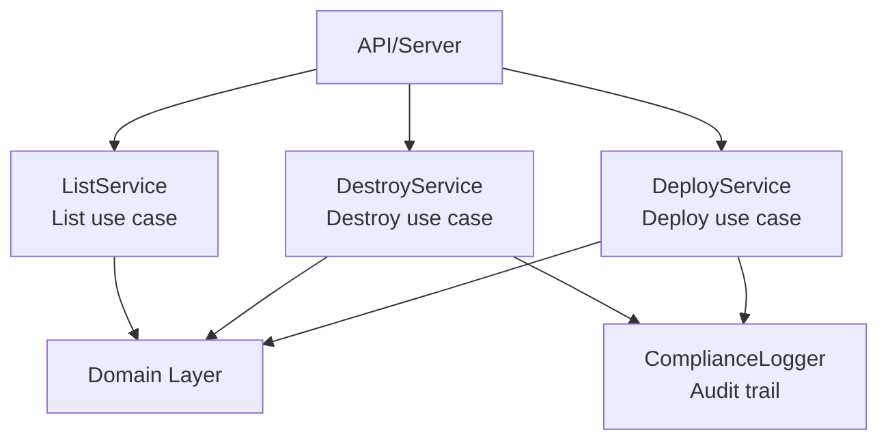

<link rel="stylesheet" href="../platform-resources/styles/virons-markdown.css">
<button onclick="const t=document.body.classList.toggle('theme-light');localStorage.setItem('theme',t?'light':'dark')" style="position:fixed;top:1rem;right:1rem;padding:0.5rem 1rem;border-radius:6px;border:1px solid var(--color-border);background:var(--color-code-bg);color:var(--color-text);cursor:pointer;z-index:1000;">Toggle Theme</button>
<script>if(localStorage.getItem('theme')==='light')document.body.classList.add('theme-light')</script>

# Virons Infrastructure MCP Server - Application Layer

## Overview

***

Use case orchestration for infrastructure operations. **BaFin/DORA compliant** — all write operations logged.

**Service layer implementing deploy/destroy/list use cases.** Dependency injection, single responsibility.

| Category | Description |
|----------|-------------|
| **Audience** | Backend developers, DevOps engineers |
| **Purpose** | Orchestrate domain logic for infrastructure ops |
| **Domain** | `virons.infrastructure_mcp_server.application` |
| **Context** | Application Layer (DDD) |
| **Status** | **Production** |
| **Provider** | Virons AI GmbH (DE) |

**Tech Docs**: [docs/architecture/model-architecture.md](../../../docs/architecture/model-architecture.md)

## Architecture

***

**Service pattern**: Each service handles one use case. Domain logic orchestration with compliance logging.

**Diagram**:

***



## Contents

***

```
application/
├── deploy_service.py       # Deploy infrastructure
├── destroy_service.py      # Destroy infrastructure
└── list_service.py         # List stacks
```

## Key Features

***

- **Single Responsibility**: Each service handles one use case
- **Dependency Injection**: Constructor-based, testable
- **Compliance First**: All write operations logged (BaFin/DORA)
- **Async/Await**: Non-blocking I/O for performance

## Usage

***

```python
# Deploy Service
service = DeployService(registry, logger)
result = await service.deploy(
    stack_name="vpc",
    tool="cdk",
    region="eu-central-1"
)

# Destroy Service
service = DestroyService(registry, logger)
result = await service.destroy(
    stack_name="vpc",
    tool="cdk",
    region="eu-central-1"
)

# List Service
service = ListService(registry)
stacks = await service.list_stacks(tool="cdk", region="eu-central-1")
```

## Dependencies

***

| Dep | Purpose | Compliance |
|-----|---------|------------|
| Domain layer | Business logic | Pure Python |
| ComplianceLogger | Audit trail | BaFin/DORA |

## Testing

***

```bash
# Unit tests with mocks
pytest tests/application/ -v

# Test coverage: 90%+
pytest tests/application/ --cov=virons.infrastructure_mcp_server.application
```

## Metrics & Monitoring

***

- **Compliance Logs**: All write operations logged (10-year retention)
- **Service Metrics**: Request counts, latencies (via Prometheus)
- **Error Tracking**: Structured logging with context

## Security & Compliance

***

| Regulation | Requirement | Implementation | Evidence |
|------------|-------------|----------------|----------|
| **BaFin MaRisk AT 8.1** | Audit trail | ComplianceLogger on all writes | [docs/compliance/evidence/bafin-compliance.md](../../../docs/compliance/evidence/bafin-compliance.md) |
| **DORA Art. 11** | ICT framework | Service-level error handling | [docs/compliance/evidence/dora-compliance.md](../../../docs/compliance/evidence/dora-compliance.md) |

## Navigation
← [infrastructure_mcp_server README](../)

***

**Last Updated**: 2026-03-07

**Maintained By**: platform@virons.ai

**Tests**: [tests/application/](../../../tests/application/)
