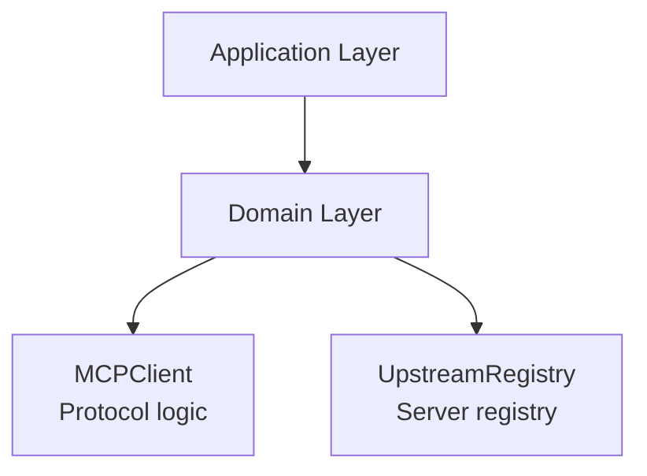

<link rel="stylesheet" href="../platform-resources/styles/virons-markdown.css">
<button onclick="const t=document.body.classList.toggle('theme-light');localStorage.setItem('theme',t?'light':'dark')" style="position:fixed;top:1rem;right:1rem;padding:0.5rem 1rem;border-radius:6px;border:1px solid var(--color-border);background:var(--color-code-bg);color:var(--color-text);cursor:pointer;z-index:1000;">Toggle Theme</button>
<script>if(localStorage.getItem('theme')==='light')document.body.classList.add('theme-light')</script>

# Virons Infrastructure MCP Server - Domain Layer

## Overview

***

Pure business logic for infrastructure management. **No external dependencies** — follows DDD principles.

**Core domain models and business rules.** Immutable, testable, framework-agnostic.

| Category | Description |
|----------|-------------|
| **Audience** | Backend developers, domain experts |
| **Purpose** | Core business logic for MCP infrastructure |
| **Domain** | `virons.infrastructure_mcp_server.domain` |
| **Context** | Domain-Driven Design (DDD) |
| **Status** | **Production** |
| **Provider** | Virons AI GmbH (DE) |

**Tech Docs**: [docs/architecture/model-architecture.md](../../../docs/architecture/model-architecture.md)

## Architecture

***

**Pure domain layer**: No frameworks, no I/O, only business logic. Immutable models, explicit dependencies.

**Diagram**:

***



## Contents

***

```
domain/
├── mcp_client.py           # MCP protocol client
└── upstream_registry.py    # Server registry
```

## Key Features

***

- **Pure Domain Logic**: No external dependencies (FastAPI, databases, etc.)
- **Immutability**: Domain models are frozen dataclasses
- **Testability**: No mocks required, pure functions
- **Explicit Dependencies**: Constructor injection only

## Usage

***

```python
# MCP Client
async with MCPClient(host="cdk-server", port=9140) as client:
    result = await client.call_tool("deploy", {"stack_name": "vpc"})

# Upstream Registry
registry = UpstreamRegistry()
registry.register("cdk", host="localhost", port=9140)
server = registry.get("cdk")
```

## Dependencies

***

| Dep | Purpose | Compliance |
|-----|---------|------------|
| Python stdlib | Core logic | No external deps |

## Testing

***

```bash
# Unit tests (no mocks)
pytest tests/domain/ -v

# Test coverage: 95%+
pytest tests/domain/ --cov=virons.infrastructure_mcp_server.domain
```

## Metrics & Monitoring

***

- **No direct metrics**: Domain layer is pure logic
- **Audit Logs**: Via application layer (compliance_logging.py)

## Security & Compliance

***

| Regulation | Requirement | Implementation | Evidence |
|------------|-------------|----------------|----------|
| **BaFin MaRisk AT 8.1** | Audit trail | Logged via app layer | [docs/compliance/evidence/bafin-compliance.md](../../../docs/compliance/evidence/bafin-compliance.md) |
| **DDD Principles** | Clean architecture | Pure domain logic | [docs/architecture/model-architecture.md](../../../docs/architecture/model-architecture.md) |

## Navigation
← [infrastructure_mcp_server README](../)

***

**Last Updated**: 2026-03-07

**Maintained By**: platform@virons.ai

**Tests**: [tests/domain/](../../../tests/domain/)
