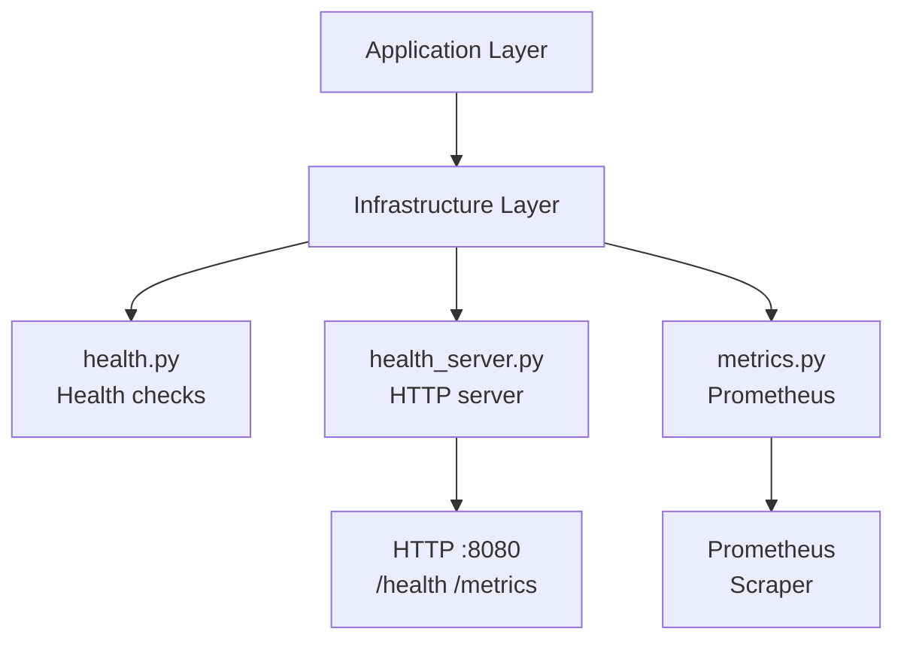

<link rel="stylesheet" href="../platform-resources/styles/virons-markdown.css">
<button onclick="const t=document.body.classList.toggle('theme-light');localStorage.setItem('theme',t?'light':'dark')" style="position:fixed;top:1rem;right:1rem;padding:0.5rem 1rem;border-radius:6px;border:1px solid var(--color-border);background:var(--color-code-bg);color:var(--color-text);cursor:pointer;z-index:1000;">Toggle Theme</button>
<script>if(localStorage.getItem('theme')==='light')document.body.classList.add('theme-light')</script>

# Virons Infrastructure MCP Server - Infrastructure Layer

## Overview

***

External integrations for health, metrics, and monitoring. **Prometheus + HTTP** — production observability.

**Adapter layer for external systems.** Health checks, metrics collection, HTTP servers.

| Category | Description |
|----------|-------------|
| **Audience** | DevOps engineers, SRE teams |
| **Purpose** | External system integrations (health/metrics) |
| **Domain** | `virons.infrastructure_mcp_server.infrastructure` |
| **Context** | Infrastructure Layer (DDD) |
| **Status** | **Production** |
| **Provider** | Virons AI GmbH (DE) |

**Tech Docs**: [docs/architecture/model-architecture.md](../../../docs/architecture/model-architecture.md)

## Architecture

***

**Adapter pattern**: Infrastructure adapts external systems to domain interfaces. Dependency inversion principle.

**Diagram**:

***



## Contents

***

```
infrastructure/
├── health.py               # Health check logic
├── health_server.py        # HTTP health server
└── metrics.py              # Prometheus metrics
```

## Key Features

***

- **Health Checks**: Liveness/readiness endpoints
- **Prometheus Metrics**: Tool duration, call counts, errors
- **HTTP Server**: Lightweight health monitoring (:8080)
- **Adapter Pattern**: External systems isolated from domain

## Usage

***

```python
# Health checks
status = get_health_status()
# {"status": "healthy", "uptime_seconds": 3600}

# Metrics recording
with record_tool_duration("deploy"):
    result = await deploy(...)
    increment_tool_calls("deploy", "success")

# Health server
server = HealthServer(port=8080)
await server.start()
```

## Dependencies

***

| Dep | Purpose | Compliance |
|-----|---------|------------|
| Prometheus | Metrics | Open source |
| HTTP stdlib | Health server | Python stdlib |

## Testing

***

```bash
# Unit tests
pytest tests/infrastructure/ -v

# Test coverage: 85%+
pytest tests/infrastructure/ --cov=virons.infrastructure_mcp_server.infrastructure
```

## Metrics & Monitoring

***

- **Prometheus Metrics**:
  - `mcp_tool_duration_seconds` — Tool execution time
  - `mcp_tool_calls_total` — Total tool calls
  - `mcp_tool_errors_total` — Error count
  - `mcp_audit_log_writes_total` — Audit writes
- **Health Endpoint**: `GET /health` — Liveness check
- **Metrics Endpoint**: `GET /metrics` — Prometheus scrape

## Security & Compliance

***

| Regulation | Requirement | Implementation | Evidence |
|------------|-------------|----------------|----------|
| **DORA Art. 11** | Monitoring | Prometheus metrics | [docs/compliance/evidence/dora-compliance.md](../../../docs/compliance/evidence/dora-compliance.md) |
| **BaFin MaRisk AT 8.1** | Audit metrics | `mcp_audit_log_writes_total` | [docs/compliance/evidence/bafin-compliance.md](../../../docs/compliance/evidence/bafin-compliance.md) |

## Navigation
← [infrastructure_mcp_server README](../)

***

**Last Updated**: 2026-03-07

**Maintained By**: platform@virons.ai

**Tests**: [tests/infrastructure/](../../../tests/infrastructure/)
