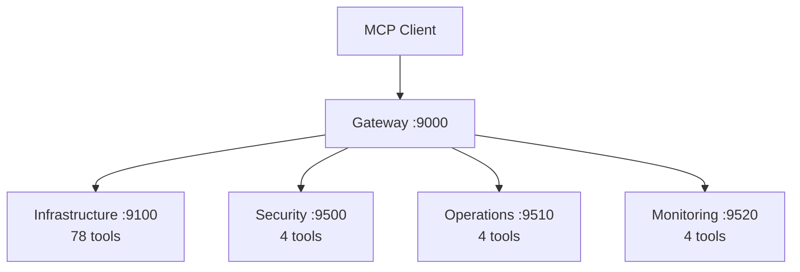

# Virons MCP Gateway

## Overview

Central gateway aggregating 90 tools from 4 backend MCP servers into a unified API.

| Category | Description |
|----------|-------------|
| **Port** | 9000 |
| **Tools** | 90 (aggregated from all backends) |
| **Backends** | 4 (infrastructure, security, operations, monitoring) |
| **Status** | Production |
| **Transport** | http, api |

## Architecture



## Key Features

- **Dynamic tool discovery** - Discovers tools from backends on startup
- **Correlation ID propagation** - x-correlation-id header for distributed tracing
- **Prometheus metrics** - Request counts, durations, errors
- **Rate limiting** - Per-client IP rate limiting (100 req/60s)
- **Health-based dependencies** - Waits for all backends to be healthy

## Usage

```bash
# Start gateway
docker-compose up -d virons-mcp-gateway

# List all tools
curl http://localhost:9000/tools | jq

# Execute tool
curl -X POST http://localhost:9000/tools/deploy_infrastructure \
  -H "Authorization: Bearer token" \
  -d '{"tool": "terraform", "stack_name": "test"}'

# Check health
curl http://localhost:9000/health
curl http://localhost:9000/ready
curl http://localhost:9000/metrics
```

## Tool Distribution

| Backend | Port | Tools | Categories |
|---------|------|-------|------------|
| Infrastructure | 9100 | 78 | backup, cost, deployment, query |
| Security | 9500 | 4 | security |
| Operations | 9510 | 4 | deployment |
| Monitoring | 9520 | 4 | monitoring |

## Dependencies

- fastapi>=0.115.0 - API server
- httpx>=0.27.0 - HTTP client for backends
- prometheus-client>=0.21.0 - Metrics
- loguru>=0.7.0 - Logging
- pydantic>=2.10.6 - Data validation

## Testing

```bash
# Run tests
pytest tests/ -v

# Coverage
pytest tests/ --cov=virons.mcp_gateway --cov-report=html
```

## Metrics & Monitoring

- **Prometheus**: `http://localhost:9000/metrics`
  - http_requests_total (method, endpoint, status)
  - http_request_duration_seconds (method, endpoint)
- **Health**: `http://localhost:9000/health` (liveness)
- **Ready**: `http://localhost:9000/ready` (readiness with backends)
- **Correlation ID**: x-correlation-id header propagation

## Security & Compliance

| Requirement | Implementation |
|-------------|----------------|
| Rate limiting | 100 requests per 60s per IP |
| Authentication | Authorization header required |
| Audit logging | All tool executions logged |
| Distributed tracing | Correlation ID propagation |

## Navigation

← [Platform MCP](../..)  
→ [Core Implementation](virons/mcp_gateway/)  
→ [Tests](tests/)
