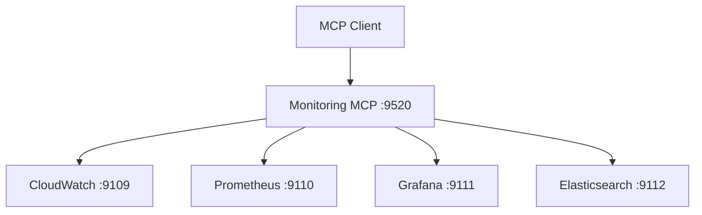

# Virons Monitoring MCP Server

## Overview

Monitoring orchestrator aggregating CloudWatch, Prometheus, Grafana, and Elasticsearch MCP servers for metrics and observability.

| Category | Description |
|----------|-------------|
| **Port** | 9520 |
| **Tools** | 4 (query, dashboard, alert, health) |
| **Upstreams** | 4 (cloudwatch, prometheus, grafana, elasticsearch) |
| **Status** | Production |
| **Transport** | stdio, http, api |

## Architecture



## Tools

1. **query_metrics** - Query metrics from CloudWatch/Prometheus
2. **create_dashboard** - Create Grafana dashboard
3. **set_alert** - Configure alert rules
4. **check_system_health** - Aggregate system health status

See [tool_metadata.py](virons/monitoring_mcp_server/tool_metadata.py) for examples.

## Usage

```bash
# Start API mode
docker-compose up -d virons-monitoring-mcp

# List tools
curl http://localhost:9520/tools | jq

# Query metrics
curl -X POST http://localhost:9520/tools/query_metrics \
  -H "Authorization: Bearer token" \
  -d '{"source": "prometheus", "query": "cpu_usage", "start": "2026-03-07T00:00:00Z"}'

# Check health
curl http://localhost:9520/health
curl http://localhost:9520/ready
```

## Dependencies

- mcp[cli]>=1.23.0 - FastMCP framework
- fastapi>=0.115.0 - API server
- prometheus-client>=0.21.0 - Metrics
- loguru>=0.7.0 - Logging
- pydantic>=2.10.6 - Data validation

## Testing

```bash
# Run tests
pytest tests/ -v

# Coverage
pytest tests/ --cov=virons.monitoring_mcp_server --cov-report=html

# Specific layer
pytest tests/application/ -v
```

## Metrics & Monitoring

- **Prometheus**: `http://localhost:9520/metrics`
- **Health**: `http://localhost:9520/health` (liveness)
- **Ready**: `http://localhost:9520/ready` (readiness with upstreams)
- **Correlation ID**: x-correlation-id header propagation

## Security & Compliance

| Requirement | Implementation |
|-------------|----------------|
| Audit logging | compliance.py with write_audit() |
| Metrics retention | 90 days default |
| Alert tracking | All alerts logged |
| Dashboard versioning | Version control for dashboards |

## Navigation

← [Platform MCP](../..)  
→ [Core Implementation](virons/monitoring_mcp_server/)  
→ [Tests](tests/)  
→ [Scripts](scripts/)
