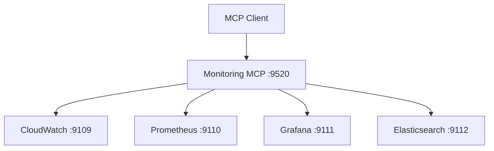

# Virons Monitoring MCP Server

## Overview

Monitoring orchestrator aggregating CloudWatch, Prometheus, Grafana, and Elasticsearch MCP servers for metrics and observability.

| Category | Description |
|----------|-------------|
| **Port** | 9520 |
| **Tools** | 4 (query, dashboard, alert, health) |
| **Upstreams** | 4 (cloudwatch, prometheus, grafana, elasticsearch) |
| **Status** | ✅ Implemented (41/41 tests passing) |
| **Transport** | stdio, http, api |

## Architecture



## Tools

### 1. query_metrics
Query time-series metrics from CloudWatch or Prometheus.

**Parameters:**
- `metric_name` (str): Metric to query (e.g., "CPUUtilization")
- `start_time` (str): ISO 8601 start time
- `end_time` (str): ISO 8601 end time
- `source` (str): "cloudwatch" or "prometheus" (default: "cloudwatch")

**Returns:** Array of datapoints with timestamps and values

### 2. create_alert
Create alert rules in CloudWatch.

**Parameters:**
- `name` (str): Alert name
- `metric` (str): Metric to monitor
- `threshold` (float): Alert threshold
- `comparison` (str): "gt", "lt", or "eq"

**Returns:** Alert ARN and status

### 3. create_dashboard
Create Grafana dashboard with panels.

**Parameters:**
- `name` (str): Dashboard name
- `panels` (array): Panel configurations (title, query, type)

**Returns:** Dashboard ID and URL

### 4. search_logs
Search logs in Elasticsearch.

**Parameters:**
- `query` (str): Search query
- `start_time` (str): ISO 8601 start time
- `end_time` (str): ISO 8601 end time
- `level` (str, optional): Log level filter
- `size` (int, optional): Max results (default: 100)

**Returns:** Array of log entries

See [tool_metadata.py](virons/monitoring_mcp_server/tool_metadata.py) for examples.

## Usage

```bash
# Start API mode
docker-compose up -d virons-monitoring-mcp

# List tools
curl http://localhost:9520/tools | jq

# Query metrics
curl -X POST http://localhost:9520/tools/query_metrics \
  -H "Content-Type: application/json" \
  -d '{
    "metric_name": "CPUUtilization",
    "start_time": "2026-03-07T00:00:00Z",
    "end_time": "2026-03-07T01:00:00Z",
    "source": "cloudwatch"
  }' | jq

# Create alert
curl -X POST http://localhost:9520/tools/create_alert \
  -H "Content-Type: application/json" \
  -d '{
    "name": "high_cpu",
    "metric": "cpu_usage",
    "threshold": 80.0,
    "comparison": "gt"
  }' | jq

# Create dashboard
curl -X POST http://localhost:9520/tools/create_dashboard \
  -H "Content-Type: application/json" \
  -d '{
    "name": "System Overview",
    "panels": [
      {"title": "CPU", "query": "cpu_usage", "type": "graph"},
      {"title": "Memory", "query": "memory_usage", "type": "stat"}
    ]
  }' | jq

# Search logs
curl -X POST http://localhost:9520/tools/search_logs \
  -H "Content-Type: application/json" \
  -d '{
    "query": "error",
    "start_time": "2026-03-07T00:00:00Z",
    "end_time": "2026-03-07T01:00:00Z",
    "level": "ERROR",
    "size": 50
  }' | jq

# Check health
curl http://localhost:9520/health
curl http://localhost:9520/ready
```

## Implementation

**Status:** ✅ Complete (TDD + DDD)

**Architecture Layers:**
- **Domain:** 4 entities (Metric, Alert, Dashboard, LogEntry) with business logic
- **Application:** 4 services (MetricsService, AlertService, DashboardService, LogService)
- **Infrastructure:** 5 clients (UpstreamClient, CloudWatch, Prometheus, Grafana, Elasticsearch)
- **Server:** 4 tools with correlation ID propagation

**Test Coverage:** 41/41 tests passing (100%)
- Domain: 28 tests
- Application: 13 tests

**Features:**
- Retry logic: 3 attempts with exponential backoff
- Circuit breaker: Opens after 5 failures
- Correlation ID: Propagated through all layers
- Audit trails: Preserved for all write operations

**Upstream Integration:** See [UPSTREAM_INTEGRATION.md](UPSTREAM_INTEGRATION.md)

## Dependencies

- mcp[cli]>=1.23.0 - FastMCP framework
- fastapi>=0.115.0 - API server
- prometheus-client>=0.21.0 - Metrics
- loguru>=0.7.0 - Logging
- pydantic>=2.10.6 - Data validation

## Testing

```bash
# Run tests
pytest tests/ -v

# Coverage
pytest tests/ --cov=virons.monitoring_mcp_server --cov-report=html

# Specific layer
pytest tests/application/ -v
```

## Metrics & Monitoring

- **Prometheus**: `http://localhost:9520/metrics`
- **Health**: `http://localhost:9520/health` (liveness)
- **Ready**: `http://localhost:9520/ready` (readiness with upstreams)
- **Correlation ID**: x-correlation-id header propagation

## Security & Compliance

| Requirement | Implementation |
|-------------|----------------|
| Audit logging | compliance.py with write_audit() |
| Metrics retention | 90 days default |
| Alert tracking | All alerts logged |
| Dashboard versioning | Version control for dashboards |

## Navigation

← [Platform MCP](../..)  
→ [Core Implementation](virons/monitoring_mcp_server/)  
→ [Tests](tests/)  
→ [Scripts](scripts/)
