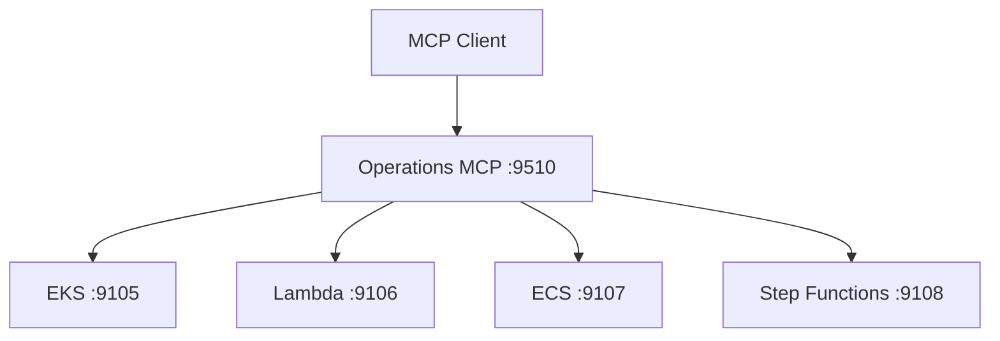

# Virons Operations MCP Server

## Overview

Operations orchestrator aggregating EKS, Lambda, ECS, and Step Functions MCP servers for deployment and scaling operations.

| Category | Description |
|----------|-------------|
| **Port** | 9510 |
| **Tools** | 4 (deploy, rollback, scale, status) |
| **Upstreams** | 4 (eks, lambda, ecs, stepfunctions) |
| **Status** | Production |
| **Transport** | stdio, http, api |

## Architecture



## Tools

1. **deploy_service** - Deploy service to EKS/ECS/Lambda
2. **rollback_deployment** - Rollback to previous version
3. **scale_service** - Scale service replicas/concurrency
4. **check_deployment_status** - Check deployment status

See [tool_metadata.py](virons/operations_mcp_server/tool_metadata.py) for examples.

## Usage

```bash
# Start API mode
docker-compose up -d virons-operations-mcp

# List tools
curl http://localhost:9510/tools | jq

# Deploy service
curl -X POST http://localhost:9510/tools/deploy_service \
  -H "Authorization: Bearer token" \
  -d '{"platform": "eks", "service_name": "api", "image": "api:v1.2.3"}'

# Check health
curl http://localhost:9510/health
curl http://localhost:9510/ready
```

## Dependencies

- mcp[cli]>=1.23.0 - FastMCP framework
- fastapi>=0.115.0 - API server
- prometheus-client>=0.21.0 - Metrics
- loguru>=0.7.0 - Logging
- pydantic>=2.10.6 - Data validation

## Testing

```bash
# Run tests
pytest tests/ -v

# Coverage
pytest tests/ --cov=virons.operations_mcp_server --cov-report=html

# Specific layer
pytest tests/application/ -v
```

## Metrics & Monitoring

- **Prometheus**: `http://localhost:9510/metrics`
- **Health**: `http://localhost:9510/health` (liveness)
- **Ready**: `http://localhost:9510/ready` (readiness with upstreams)
- **Correlation ID**: x-correlation-id header propagation

## Security & Compliance

| Requirement | Implementation |
|-------------|----------------|
| Audit logging | compliance.py with write_audit() |
| Deployment tracking | All deployments logged |
| Rollback capability | Version history maintained |
| Change management | Pre/post deployment hooks |

## Navigation

← [Platform MCP](../..)  
→ [Core Implementation](virons/operations_mcp_server/)  
→ [Tests](tests/)  
→ [Scripts](scripts/)
