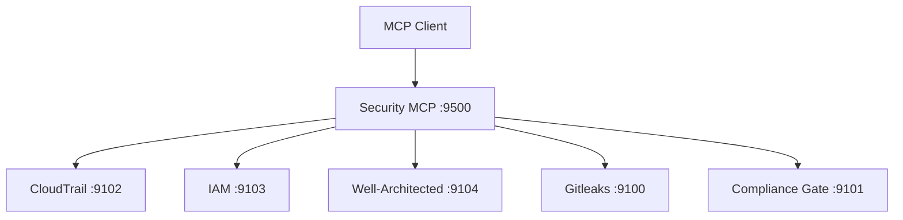

# Virons Security MCP Server

## Overview

Security orchestrator aggregating CloudTrail, IAM, Well-Architected Security, Gitleaks, and Compliance Gate MCP servers.

| Category | Description |
|----------|-------------|
| **Port** | 9500 |
| **Tools** | 4 (secrets, audit, IAM, compliance) |
| **Upstreams** | 5 (cloudtrail, iam, well-architected, gitleaks, compliance-gate) |
| **Status** | Production |
| **Transport** | stdio, http, api |

## Architecture



## Tools

1. **scan_secrets** - Scan repository for secrets using Gitleaks
2. **audit_cloudtrail** - Query CloudTrail audit logs
3. **check_iam_policy** - Validate IAM policy against security best practices
4. **run_compliance_gate** - Run compliance gate checks

See [tool_metadata.py](virons/security_mcp_server/tool_metadata.py) for examples.

## Usage

```bash
# Start API mode
docker-compose up -d virons-security-mcp

# List tools
curl http://localhost:9500/tools | jq

# Scan secrets
curl -X POST http://localhost:9500/tools/scan_secrets \
  -H "Authorization: Bearer token" \
  -d '{"repository_path": "/path/to/repo", "scan_history": false}'

# Check health
curl http://localhost:9500/health
curl http://localhost:9500/ready
```

## Dependencies

- mcp[cli]>=1.23.0 - FastMCP framework
- fastapi>=0.115.0 - API server
- prometheus-client>=0.21.0 - Metrics
- loguru>=0.7.0 - Logging
- pydantic>=2.10.6 - Data validation

## Testing

```bash
# Run tests
pytest tests/ -v

# Coverage
pytest tests/ --cov=virons.security_mcp_server --cov-report=html

# Specific layer
pytest tests/application/ -v
```

## Metrics & Monitoring

- **Prometheus**: `http://localhost:9500/metrics`
- **Health**: `http://localhost:9500/health` (liveness)
- **Ready**: `http://localhost:9500/ready` (readiness with upstreams)
- **Correlation ID**: x-correlation-id header propagation

## Security & Compliance

| Requirement | Implementation |
|-------------|----------------|
| Audit logging | compliance.py with write_audit() |
| Secret scanning | Gitleaks integration |
| IAM validation | AWS IAM best practices |
| Compliance gates | Pre-commit/deploy/post-deploy checks |

## Navigation

← [Platform MCP](../..)  
→ [Core Implementation](virons/security_mcp_server/)  
→ [Tests](tests/)  
→ [Scripts](scripts/)
